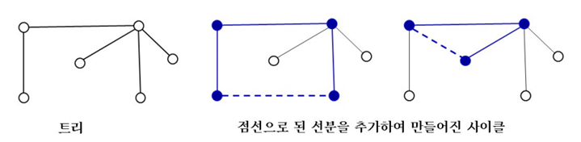
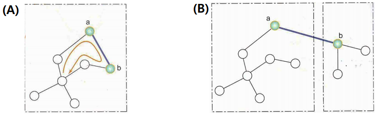

<br>

# **1. 개요**

그리디 알고리즘 해결 방식의 일종

주어진 그래프의 신장 트리를 찾는 방법

* 사이클이 생기지 않도록 모든 정점을 연결

* 그래프 내의 정점의 수 = n

  * 신장 트리에는 정확히 (n-1)개의 간선이 있음
  
  * 트리에 간선을 하나 추가시키면 반드시 사이클이 생성됨



<br><br>


# **2. 유형**

## **2.1. Kruskal 알고리즘**

### **2.1.1. 이론**

최소 신장 트리가 최소 비용의 간선으로 구성됨가 동시에 사이클을 포함하지 않는다는 조건에 근거해 고안된 알고리즘이다.

각 단계에서 사이클을 이루지 않는 <span style='background-color: #cdd8bd '>**최소 가중치를 갖는 간선**</span>을 선택한다.


<br>


* **크루스칼 알고리즘의 MST 구축 순서**
  
  1. 그래프 내의 모든 간선들을 가중치에 따라 오름차순으로 정렬
  
  2. 정렬된 간선들의 리스트에서 맨 앞에 위치한 간선 선택
  
  3. 선택한 간선이 사이클을 생성하는지 확인
  
     1. 사이클 생성 X => 해당 간선을 그래프에 추가
  
     2. 사이클 생성 O => 해당 간선은 제외하고 과정 2 반복


<br><br>

### **2.1.2. 의사 코드**

```c
// KruskalMST(G)
// input: 가중치 그래프 G=(V, E), |V|=n, |E|=m
// output: 최소 신장 트리 T

1. L = 가중치의 오름차순으로 간선들을 정렬한 간선 리스트
2. T = init empty set
3. while(T의 간선 수 < n-1)
4.    L에서 가장 작은 가중치를 가진 간선 e를 가져옴
5.    e를 L에서 제거
6.    if(간선 e가 T에 추가되어 사이클을 만들지 않으면)
7.        e를 T에 추가
8.    else    // e가 T에 추가되어 사이클이 생기는 경우
9.        e 버림
10. return 트리 T   // T는 최소 신장 트리
```


<br><br> **2.1.3. 수행 과정**

**새로운 간선을 추가할 때 사이클의 발생 여부 확인 방법**



* **(A)** 간선의 양 끝 정점 모두 같은 집합에 속하는 경우 

   =>해당 간선을 추가할 때 사이클이 형성됨

* **(B)** 간선의 양 끝 정점 모두 다른 집합에 속하는 경우

   => 해당 간선을 추가해도 사이클이 형성되지 않음 

위 사례는 <span style='background-color: #cdd8bd '>**Union-Find 연산**</span>을 통해 효과적으로 수행할 수 있다!!!


<br>


## **2.1.4. 시간복잡도**

* **Line 1:** m개의 간선 정렬을 위한 수행 시간 $O(mlogm)$

* **Line 2:** T를 초기화하는 수행 시간: $O(1)$

* **Line 3~8:**
  
  * while-루프는 최대 `m`번 수행
  
    * 그래프의 모든 간선이 `while` 루프 내에서 처리되는 경우
  
  * while-루프 내에서는 `L`로부터 가져온 간선 `e`가 사이클을 만드는지를 검사하는 데 대략 $O(1)$ 시간 소요
  

<br>

**=> 크루스칼 알고리즘의 시간 복잡도 : `O(mlogm)`**


<br><br>


## **2.2. Prim 알고리즘**


### **2.2.1. 이론**


시작 정점에서 출발해 신장 트리 집합을 단계적으로 확장하는 방법이다.

* Kruskal 알고리점과 차이점

  * 그래프의 정점을 추가하는 과정을 통해 최소 신장 트리 구축

      *cf) 크루스칼: 간선 위주 알고리즘*

<br>

*   Prim 알고리즘의 MST 구축 순서
    1.   시작 단계: 시작 정점만이 신장 트리 집합에 포함
    2.   앞 단계에서 만들어진 신장 트리 집합에, 인접한 정점들 중에서 최저 가중치 간선으로 연결된 트리 선택 => 트리 확장!
    3.   트리가 n-1개의 간선을 가질 때까지 위 과정 반복

<br>

### 2.2.2. 의사 코드

```c
// PrimMST(G)
// input: 가중치 그래프 G=(V, E), |V|=n, |E|=m
// output: 최소 신장 트리 T

1. G에서 임의의 점 p를 시작점으로 선택 D[p] = 0
	// D[v]는 T에 있는 u와 v를 연결하는 간선의 최소 가중치를 저장하기 위한 원소
2. for(점 p가 아닌 각 점 v에 대하여)
3.    if(간선 (p, v)가 그래프에 있으면)
4.        D[v] = 간선 (p, v)의 가중치
5.    else
6.        D[v] = inf
7. T = {p}
8. while(T에 있는 점의 수 < n)
9.    for(T에 속하지 않은 각 점 v에 대해서)
10.       D[v]가 최소인 점 v_min과 연결된 간선 (u, v_min)을 T에 추가
          // u는 T에 속한 점이고, 점 v_min도 T에 추가
11.   for(T에 속하지 않은 각 점 w에 대해서)
12.       if(간선 (v_min, w)의 가중치 < D[w])
13.           D[w] = 간선 (v_min, w)의 가중치   // D[w] 갱신
14. return T    // T는 최소 신장 트리
```

<br>

### 2.2.3. 시간 복잡도

* while-루프가 (n-1)회 반복

    * 1회 반복될 때 `line 9`에서 `T`에 속하지 않은 각 점 `v`에 대하여, `D[v]`가 최소한 점 v_min을 찾는데 $O(n)$ 시간 소요

        => 왜? 배열 `D`에서 최솟값을 찾는 것이고, 배열의 크기는 `n`이기 때문 *(`D` : 현재 `T`에 속하지 않은 점들에 대해서)*

* Prim 알고리즘 

    * while 반복문에서 소요되는 시간: (n-1) x O(n) = $O(n^{2})$
    * 최소 힙을 사용해 v_min을 찾으면 $O(mlogm)$ (m=간선의 수)
    * 간선의 수가 O(n)이면, 총 시간 복잡도는 $O(nlogn)$


<br><br>

## 2.3. Kruskal vs Prim

*   Kruskal
    *   간선이 1개씩 추가
        *   n개의 점들이 각각의 트리인 상태임!
        *   간선이 추가되면 2개의 트리가 1개로 병합되는 것
    *   위 과정을 반복해 1개의 트리인 T 생성
    *   <span style='background-color: #cdd8bd '>n개의 트리들이 점차 합쳐지면서</span> 1개의 신장 트리가 완성됨

<br>

*   Prim
    *   T가 점 1개인 트리에서 시작되어 간선을 1개씩 추가
    *   <span style='background-color: #cdd8bd '>1개의 트리가 점차적으로 자라나면서</span> 신장 트리가 완성됨
