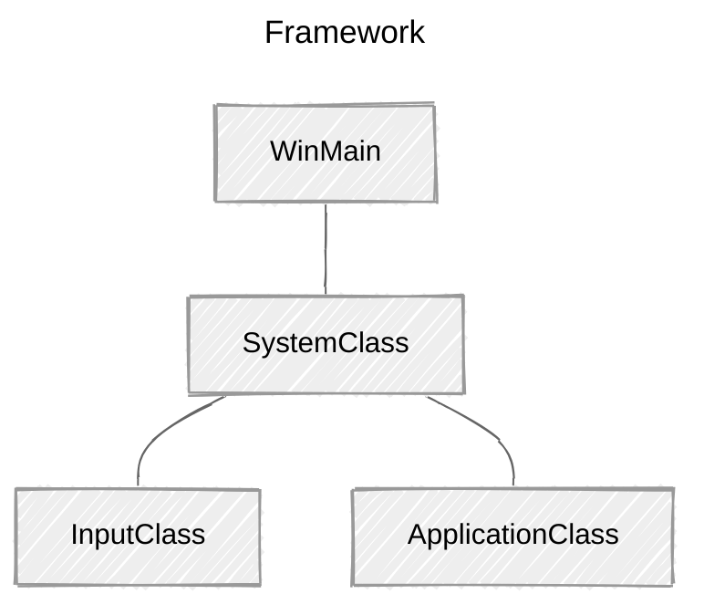

> **📖 참고자료**
>
> * [RasterTek - DirectX 11 on Windows 10 Tutorials](https://rastertek.com/tutdx11win10.html)
>
> <br>
> 
> **🖥️ 개발환경**
> 
> *   Window 11
> *   Visual Studio 2022
>

<br>

DirectX11로 코딩을 시작하기 전에 간단한 프레임워크를 구축하는 것이 좋다.

해당 프레임워크는 기본적인 Windows 기능을 처리하고, DX11을 학습하기 위해 코드를 체계적이고 읽기 쉽게 확장할 수 있는 방법을 알려준다.

*rastertek 튜토리얼은 다양한 기능을 시도해 보는 것이므로, 프레임워크를 가볍게 유지하고 자체 렌더링 엔진을 만들지 않는다.*

<br>

## 프레임워크

프레임워크는 4가지 항목으로 시작한다.




* `WinMain`: 애플리케이션의 진입점 처리
  * `SystemClass`: WinMain 함수 내에서 호출되는 애플리케이션 전체를 캡슐화
    * `InputClass`: 사용자 입력 처리
    * `ApplicationClass`: DirectX 그래픽 코드 처리

<br>

## WinMain

<br>

```c++
// Filename: main.cpp

#include "systemclass.h"


int WINAPI WinMain(HINSTANCE hInstance, HINSTANCE hPrevInstance, PSTR pScmdline, int iCmdshow)
{
	SystemClass* System;
	bool result;
	
	
	// Create the system object.
	System = new SystemClass;

	// Initialize and run the system object.
	result = System->Initialize();
	if(result)
	{
		System->Run();
	}

	// Shutdown and release the system object.
	System->Shutdown();
	delete System;
	System = 0;

	return 0;
}
```

WinMain 함수에서 SystemClass를 생성한 후 초기화한다.

초기화에 문제가 없으면 SystemClass의 `Run`함수를 호출한다.

`Run` 함수는 자체적으로 반복문을 실행하고 애플리케이션 코드가 완료될 때까지 동작한다. `Run` 함수가 완료된 후 System object를 종료한다. 

전체 애플리케이션을 SystemClass 내부에 캡슐화해 간단하게 유지한다.


<br>

## SystemClass.h

<br>

```c++
////////////////////////////////////////////////////////////////////////////////
// Filename: systemclass.h
////////////////////////////////////////////////////////////////////////////////

#ifndef _SYSTEMCLASS_H_
#define _SYSTEMCLASS_H_
```

```c++
///////////////////////////////
// PRE-PROCESSING DIRECTIVES //
///////////////////////////////
#define WIN32_LEAN_AND_MEAN
```


`WIN32_LEAN_AND_MEAN`을 정의한다.

* 빌드 프로세스를 가속화하기 위해 사용하지 않는 일부 Win32 API 제외

  => Win32 헤더 파일의 크기 줄임


<br>

```c++
//////////////
// INCLUDES //
//////////////
#include <windows.h>

///////////////////////
// MY CLASS INCLUDES //
///////////////////////
#include "inputclass.h"
#include "applicationclass.h"
```

`windows.h`를 포함해  윈도우의 생성자/소멸자 함수와 기타 win32 함수를 호출할 수 있게 한다. 프레임워크의 두 클래스를 include해 시스템 클래스에서 사용할 수 있도록 한다.

<br>

```c++
////////////////////////////////////////////////////////////////////////////////
// Class name: SystemClass
////////////////////////////////////////////////////////////////////////////////
class SystemClass
{
public:
	SystemClass();
	SystemClass(const SystemClass&);
	~SystemClass();

	bool Initialize();
	void Shutdown();
	void Run();

	LRESULT CALLBACK MessageHandler(HWND, UINT, WPARAM, LPARAM);

private:
	bool Frame();
	void InitializeWindows(int&, int&);
	void ShutdownWindows();

private:
	LPCWSTR m_applicationName;
	HINSTANCE m_hinstance;
	HWND m_hwnd;

	InputClass* m_Input;
	ApplicationClass* m_Application;
};
```

클래스 정의

* `WinMain`에서 호출된 `Initialize`, `Shotdown`, `Run` 함수
* 해당 함수에서 호출될 private 함수
* `MessageHandler`
  * 시스템이 실행되는 동안 애플리케이션에 전송될 Windows System message 처리
* `m_Input`, `m_Application`
  * 입력과 그래픽 렌더링을 처리할 두 객체에 대한 포인터

<br>

```c++
/////////////////////////
// FUNCTION PROTOTYPES //
/////////////////////////
static LRESULT CALLBACK WndProc(HWND, UINT, WPARAM, LPARAM);

/////////////
// GLOBALS //
/////////////
static SystemClass* ApplicationHandle = 0;

#endif
```

`wndProc`, `ApplicationHandle`

=> 윈도우 시스템 메시지를 SystemClass의 MessageHandler 함수로 리디렉션할 수 있다.

<br>


## Systemclass.cpp

### 생성자

```c++
////////////////////////////////////////////////////////////////////////////////
// Filename: systemclass.cpp
////////////////////////////////////////////////////////////////////////////////
#include "systemclass.h"
```

```c++
SystemClass::SystemClass()
{
    m_Input = 0;
    m_Application = 0;
}
```

클래스 생성자에서 객체 포인터를 null로 초기화한다.

객체 초기화가 실패한 경우 `Shotdown` 함수가 해당 객체를 정리를 시도한다. 만약, 객체가 null이 아니라면 유효한 객체라고 판단하고 정리한다.

애플리케이션에서 모든 포인터와 변수를 null로 초기화하는 습관을 들이는 것이 좋다. 빌드 시 실패할 수도 있기 때문!


<br>

### 복사생성자&소멸자

```c++
SystemClass::SystemClass(const SystemClass& other)
{
}

SystemClass::~SystemClass()
{
}

```

복사 생성자와 소멸자가 공란일 경우 컴파일러가 임의로 만들 수 있다. 빈 복사 생성자와 소멸자를 만들어 놓는다.

<br>

### Initialize

```c++
bool SystemClass::Initialize()
{
    int screenWidth, screenHeight;
    bool result;

    // 화면 너비와 높이를 0으로 초기화한 후 InitializeWindows에 변수 전달
    screenWidth = 0;
    screenHeight = 0;

    // Initialize the windows api.
    InitializeWindows(screenWidth, screenHeight);

    // 입력 객체 생성 후 초기화
    // 사용자의 키보드 입력을 읽는데 사용됨
    m_Input = new InputClass;
    m_Input->Initialize();

    // 애플리케이션 객체 생성 후 초기화
    // 애플리케이션의 모든 그래픽을 렌더링하는 데 사용
    m_Application = new ApplicationClass;

    result = m_Application->Initialize(screenWidth, screenHeight, m_hwnd);
    if(!result)
    {
        return false;
    }

    return true;
}
```

`bool SystemClass::Initialize()`: 애플리케이션 설정을 수행

* `InitializeWindows`를 호출해 애플리케이션에서 사용할 창 생성
* 애플리케이션에서 사용자 입력을 처리
* 화면에 그래픽을 렌더링하는데 사용할 입력/애플리케이션 객체를 생성 후 초기화


<br>

### Shutdown 

```c++
void SystemClass::Shutdown()
{
	// Release the application class object.
	if(m_Application)
	{
		m_Application->Shutdown();
		delete m_Application;
		m_Application = 0;
	}

	// Release the input object.
	if(m_Input)
	{
		delete m_Input;
		m_Input = 0;
	}

	// Shutdown the window.
	ShutdownWindows();
	
	return;
}
```

`void SystemClass::Shutdown()`: 연관 동작 정리

* 애플리케이션 및 입력 객체와 관련된 모든 것을 종료 및 해제
* 윈도우를 종료하고 관련 핸들 정리

<br>

### Run

```c++
void SystemClass::Run()
{
	MSG msg;
	bool done, result;


	// Initialize the message structure.
	ZeroMemory(&msg, sizeof(MSG));
	
	// Loop until there is a quit message from the window or the user.
	done = false;
	while(!done)
	{
		// Handle the windows messages.
		if(PeekMessage(&msg, NULL, 0, 0, PM_REMOVE))
		{
			TranslateMessage(&msg);
			DispatchMessage(&msg);
		}

		// If windows signals to end the application then exit out.
		if(msg.message == WM_QUIT)
		{
			done = true;
		}
		else
		{
			// Otherwise do the frame processing.
			result = Frame();
			if(!result)
			{
				done = true;
			}
		}

	}

	return;
}
```

`void SystemClass::Run()`

* 애플리케이션이 종료하기 전까지 모든 동작 처리

* 애플리케이션 처리: 각 loop마다 호출되는 Frame 함수에서 수행

  => 애플리케이션 구현 시 염두에 두자!

  ```
  // pseudo code
  
  While 종료 전
  	윈도우 시스템 메시지 확인
  	시스템 메시지 처리
  	애플리케이션 루프 처리
  	프레임 작업마다, 사용자가 종료를 원하는지 확인
  ```


<br>


### Frame

```c++
bool SystemClass::Frame()
{
	bool result;


	// Check if the user pressed escape and wants to exit the application.
	if(m_Input->IsKeyDown(VK_ESCAPE))
	{
		return false;
	}

	// Do the frame processing for the application class object.
	result = m_Application->Frame();
	if(!result)
	{
		return false;
	}

	return true;
}
```

`void SystemClass::Frame()`

* 애플리케이션의 모든 동작을 처리하는 함수
* input object를 확인해 사용자가 `Esc`키를 눌러 종료하려는지 확인
* 종료를 원하지 않으면 ApplicationClass 객체를 호출해 프레임 처리 수행
  * 이 과정에서 해당 프레임의 그래픽 렌더링 수행


<br>

### MessageHandler

```c++
LRESULT CALLBACK SystemClass::MessageHandler(HWND hwnd, UINT umsg, WPARAM wparam, LPARAM lparam)
{
	switch(umsg)
	{
		// Check if a key has been pressed on the keyboard.
		case WM_KEYDOWN:
		{
			// If a key is pressed send it to the input object so it can record that state.
			m_Input->KeyDown((unsigned int)wparam);
			return 0;
		}

		// Check if a key has been released on the keyboard.
		case WM_KEYUP:
		{
			// If a key is released then send it to the input object so it can unset the state for that key.
			m_Input->KeyUp((unsigned int)wparam);
			return 0;
		}

		// Any other messages send to the default message handler as our application won't make use of them.
		default:
		{
			return DefWindowProc(hwnd, umsg, wparam, lparam);
		}
	}
}
```

`LRESULT CALLBACK SystemClass::MessageHandler(HWND hwnd, UINT umsg, WPARAM wparam, LPARAM lparam)`

*   Windows의 시스템 메시지 처리

    *   관심있는 특정 정보를 들을 수 있음

        *예제) 키가 눌렸는지 해제되었는지를 읽고, Input 객체에 전달*

    *   특정 정보 이외의 모든 정보들은 Windows 기본 메시지 처리기로 다시 전달

<br>

### InitializeWindows

```c++
void SystemClass::InitializeWindows(int& screenWidth, int& screenHeight)
{
	WNDCLASSEX wc;
	DEVMODE dmScreenSettings;
	int posX, posY;


	// Get an external pointer to this object.	
	ApplicationHandle = this;

	// Get the instance of this application.
	m_hinstance = GetModuleHandle(NULL);

	// Give the application a name.
	m_applicationName = L"Engine";

	// Setup the windows class with default settings.
	wc.style         = CS_HREDRAW | CS_VREDRAW | CS_OWNDC;
	wc.lpfnWndProc   = WndProc;
	wc.cbClsExtra    = 0;
	wc.cbWndExtra    = 0;
	wc.hInstance     = m_hinstance;
	wc.hIcon         = LoadIcon(NULL, IDI_WINLOGO);
	wc.hIconSm       = wc.hIcon;
	wc.hCursor       = LoadCursor(NULL, IDC_ARROW);
	wc.hbrBackground = (HBRUSH)GetStockObject(BLACK_BRUSH);
	wc.lpszMenuName  = NULL;
	wc.lpszClassName = m_applicationName;
	wc.cbSize        = sizeof(WNDCLASSEX);
	
	// Register the window class.
	RegisterClassEx(&wc);

	// Determine the resolution of the clients desktop screen.
	screenWidth  = GetSystemMetrics(SM_CXSCREEN);
	screenHeight = GetSystemMetrics(SM_CYSCREEN);

	// Setup the screen settings depending on whether it is running in full screen or in windowed mode.
	if(FULL_SCREEN)
	{
		// If full screen set the screen to maximum size of the users desktop and 32bit.
		memset(&dmScreenSettings, 0, sizeof(dmScreenSettings));
		dmScreenSettings.dmSize       = sizeof(dmScreenSettings);
		dmScreenSettings.dmPelsWidth  = (unsigned long)screenWidth;
		dmScreenSettings.dmPelsHeight = (unsigned long)screenHeight;
		dmScreenSettings.dmBitsPerPel = 32;			
		dmScreenSettings.dmFields     = DM_BITSPERPEL | DM_PELSWIDTH | DM_PELSHEIGHT;

		// Change the display settings to full screen.
		ChangeDisplaySettings(&dmScreenSettings, CDS_FULLSCREEN);

		// Set the position of the window to the top left corner.
		posX = posY = 0;
	}
	else
	{
		// If windowed then set it to 800x600 resolution.
		screenWidth  = 800;
		screenHeight = 600;

		// Place the window in the middle of the screen.
		posX = (GetSystemMetrics(SM_CXSCREEN) - screenWidth)  / 2;
		posY = (GetSystemMetrics(SM_CYSCREEN) - screenHeight) / 2;
	}

	// Create the window with the screen settings and get the handle to it.
	m_hwnd = CreateWindowEx(WS_EX_APPWINDOW, m_applicationName, m_applicationName, 
				WS_CLIPSIBLINGS | WS_CLIPCHILDREN | WS_POPUP,
				posX, posY, screenWidth, screenHeight, NULL, NULL, m_hinstance, NULL);

	// Bring the window up on the screen and set it as main focus.
	ShowWindow(m_hwnd, SW_SHOW);
	SetForegroundWindow(m_hwnd);
	SetFocus(m_hwnd);

	// Hide the mouse cursor.
	ShowCursor(false);

	return;
}
```

`void SystemClass::InitializeWindows(int& screenWidth, int& screenHeight)`

*   개발자는 해당 함수에 렌더링에 사용할 창을 생성하는 코드를 작성
*   `InitializeWindows`를 호출한 함수에 `screenWidth`와 `screenHeight`를 반환
    *   애플리케이션 전반에 활용할 수 있도록 함
    *   기본 설정 시 테두리가 없는 검은색 윈도우로 초기화
    *   전역변수 `FULL_SCREEN`에 따라 창, 전체 화면으로 조절
        *   `true`: 전체 화면 윈도우
        *   `false`: 800x600 크기의 윈도우
    *   `applicationclass.h` 파일 맨 위에 추가해 수정할 수 있도록 함
        *   *왜  해당 파일의 헤더 대신 전역 변수를 추가했는지 생각해보자!*
            1.   변수의 역할 분리? SystemClass는 시스템 전반을 다루는 반면, ApplicationClass는 그래픽 관련을 다루기 때문(설정을 변경하기도 용이)
            2.   SystemClass에 정의되어 있으면, SystemClass의 다른 기능이 필요하지 않은 파일들도 헤더에 포함해야 함. 그래픽이 필요한 헤더만 불러오도록 하자.

<br>

### ShutdownWindows

```c++
void SystemClass::ShutdownWindows()
{
	// Show the mouse cursor.
	ShowCursor(true);

	// Fix the display settings if leaving full screen mode.
	if(FULL_SCREEN)
	{
		ChangeDisplaySettings(NULL, 0);
	}

	// Remove the window.
	DestroyWindow(m_hwnd);
	m_hwnd = NULL;

	// Remove the application instance.
	UnregisterClass(m_applicationName, m_hinstance);
	m_hinstance = NULL;

	// Release the pointer to this class.
	ApplicationHandle = NULL;

	return;
}
```

`void SystemClass::ShutdownWindows()`

*   화면 설정을 원래대로 복원
*   윈도우와 관련된 핸들 해제


<br>

### WndProc


```c++
LRESULT CALLBACK WndProc(HWND hwnd, UINT umessage, WPARAM wparam, LPARAM lparam)
{
	switch(umessage)
	{
		// 윈도우가 Destroy되었는지 확인
		case WM_DESTROY:
		{
			PostQuitMessage(0);	// 애플리케이션 종료 요청
			return 0;
		}

		// 창이 닫혔는지 확인
		case WM_CLOSE:
		{
			PostQuitMessage(0);		
			return 0;
		}

		// 그 외 모든 메시지는 SystemClass의 MessageHandler로 전달
		default:
		{
			return ApplicationHandle->MessageHandler(hwnd, umessage, wparam, lparam);
		}
	}
}
```


`LRESULT CALLBACK WndProc(HWND hwnd, UINT umessage, WPARAM wparam, LPARAM lparam)`

*   Windows가 메시지를 보내는 곳
    *   `WndProc`은 `InitializeWindows` 함수를 통해 Windows에게 알림(`wc.lpfnWndProc = WndProc;`)
*   SystemClass와 직접 연계되도록 해당 클래스 파일에 포함됨
    *   모든 메시지를 **SystemClass 내의 MessageHandler 함수로 전달**하도록 설계됨
    *   메시지 처리 기능이 클래스 내부에 자연스럽게 통합됨(+ 코드가 깔끔하게 유지)


<br>

## Inputclass

```c++
////////////////////////////////////////////////////////////////////////////////
// Filename: inputclass.h
////////////////////////////////////////////////////////////////////////////////
#ifndef _INPUTCLASS_H_
#define _INPUTCLASS_H_


////////////////////////////////////////////////////////////////////////////////
// Class name: InputClass
////////////////////////////////////////////////////////////////////////////////
class InputClass
{
public:
	InputClass();
	InputClass(const InputClass&);
	~InputClass();

	void Initialize();

	void KeyDown(unsigned int);
	void KeyUp(unsigned int);

	bool IsKeyDown(unsigned int);

private:
	bool m_keys[256];
};

#endif

```

```c++
////////////////////////////////////////////////////////////////////////////////
// Filename: inputclass.cpp
////////////////////////////////////////////////////////////////////////////////
#include "inputclass.h"


InputClass::InputClass()
{
}


InputClass::InputClass(const InputClass& other)
{
}


InputClass::~InputClass()
{
}


void InputClass::Initialize()
{
	int i;
	

	// 모든 키의 상태 초기화(released)
	for(i=0; i<256; i++)
	{
		m_keys[i] = false;
	}

	return;
}


void InputClass::KeyDown(unsigned int input)
{
	// 특정 키가 눌렸을 경우, 상태를 pressed로 저장
	m_keys[input] = true;
	return;
}


void InputClass::KeyUp(unsigned int input)
{
	// 특정 키가 해제되었을 경우, 상태를 released로 저장
	m_keys[input] = false;
	return;
}


bool InputClass::IsKeyDown(unsigned int key)
{
	// 특정 키의 눌림 여부 반환(true:눌림 / false:해제)
	return m_keys[key];
}

```


InputClass는 키보드에서 사용자 입력을 처리한다. 

*   `SystemClass::MessageHandler` 함수로부터 입력을 받음
*   키보드 배열(`m_key[256]`)을 사용해 각 키의 상태 저장
    *   이후, 호출 함수에서 특정 키의 상태를 확인할 때, 해당 키가 눌렸는지를 반환

*DirectInput이 더 효과적인 입력 방식이다! 튜토리얼을 간단히 하기 위해 Window 입력 사용함*

<br>

## Applicationclass.h

```c++
////////////////////////////////////////////////////////////////////////////////
// Filename: applicationclass.h
////////////////////////////////////////////////////////////////////////////////
#ifndef _APPLICATIONCLASS_H_
#define _APPLICATIONCLASS_H_


//////////////
// INCLUDES //
//////////////
#include <windows.h>


/////////////
// GLOBALS //
/////////////
const bool FULL_SCREEN = false;
const bool VSYNC_ENABLED = true;
const float SCREEN_DEPTH = 1000.0f;
const float SCREEN_NEAR = 0.3f;
We'll need these four globals to start with.

////////////////////////////////////////////////////////////////////////////////
// Class name: ApplicationClass
////////////////////////////////////////////////////////////////////////////////
class ApplicationClass
{
public:
	ApplicationClass();
	ApplicationClass(const ApplicationClass&);
	~ApplicationClass();

	bool Initialize(int, int, HWND);
	void Shutdown();
	bool Frame();

private:
	bool Render();

private:

};

#endif
```

ApplicationClass는 시스템 클래스에서 생성되는 객체 중 하나다.

*   그래픽 관련 기술 캡슐화
    *   모든 그래픽 기술이 ApplicationClass에 포함됨
*   전체 화면/창 화면 등 그래픽과 관련된 전역 설정 정의

*향후 튜토리얼에서 그래픽 객체가 포함될 예정이다!*

<br>

## Applicationclass.cpp

```c++
////////////////////////////////////////////////////////////////////////////////
// Filename: applicationclass.cpp
////////////////////////////////////////////////////////////////////////////////
#include "applicationclass.h"


ApplicationClass::ApplicationClass()
{
}


ApplicationClass::ApplicationClass(const ApplicationClass& other)
{
}


ApplicationClass::~ApplicationClass()
{
}


bool ApplicationClass::Initialize(int screenWidth, int screenHeight, HWND hwnd)
{

	return true;
}


void ApplicationClass::Shutdown()
{

	return;
}


bool ApplicationClass::Frame()
{

	return true;
}


bool ApplicationClass::Render()
{

	return true;
}
```

*빈 Applicationclass 구현부(프레임워크를 구축하는 중).*

<br>

## Summary

*   프레임워크와 창 화면을 생성할 수 있다.
*   모든 튜토리얼의 기반이 되므로, 위 작업을 이해하는 것이 매우 중요함!
*   해당 코드가 컴파일되고 제대로 작동하는지 확인할 것

<br>

## To Do Exercises

1.   `applicationclass.h`에서 `FULL_SCREEN`을 `true`로 변경한 후 프로그램을 컴파일하고 실행해보자.

     *창이 표시되면 `ESC`를 눌러 프로그램 종료*

<br>

## 결과


