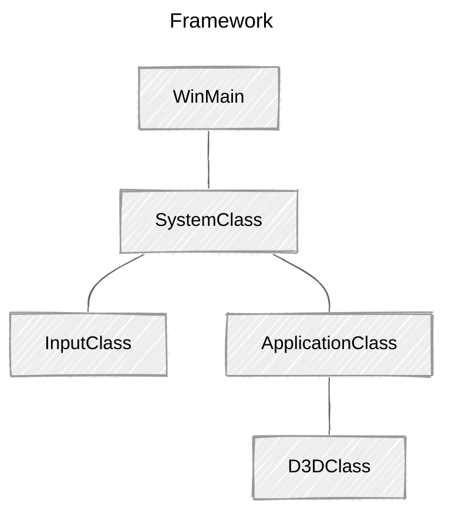

> **📖 참고자료**
>
> * [RasterTek - DirectX 11 on Windows 10 Tutorials](https://rastertek.com/tutdx11win10.html)
>
> <br>
> 
> **🖥️ 개발환경**
> 
> *   Window 11
> *   Visual Studio 2022
>

<br>

## Updated Framework



Direct3D 기능을 처리하는 새 클래스를 추가한다(`D3DClass`).

ApplicationClass 내부에 그래픽 관련 클래스가 캡슐화되므로, D3DClass도 ApplicationClass 내부에 포함된다. 

<br>

## ApplicationClass.h

```c++
////////////////////////////////////////////////////////////////////////////////
// Filename:  applicationclass.h
////////////////////////////////////////////////////////////////////////////////
#ifndef _APPLICATIONCLASS_H_
#define _APPLICATIONCLASS_H_
```

```c++
///////////////////////
// MY CLASS INCLUDES //
///////////////////////
#include "d3dclass.h"

/////////////
// GLOBALS //
/////////////
const bool FULL_SCREEN = false;
const bool VSYNC_ENABLED = true;
const float SCREEN_DEPTH = 1000.0f;
const float SCREEN_NEAR = 0.3f;


////////////////////////////////////////////////////////////////////////////////
// Class name: ApplicationClass
////////////////////////////////////////////////////////////////////////////////
class ApplicationClass
{
public:
	ApplicationClass();
	ApplicationClass(const ApplicationClass&);
	~ApplicationClass();

	bool Initialize(int, int, HWND);
	void Shutdown();
	bool Frame();

private:
	bool Render();

private:
	D3DClass* m_Direct3D;
};

#endif
```

**변경점**

1.   `windows.h` 대신 `d3dclass.h`를 include
2.   D3DClass의 새 private 포인터(`m_Direct3D`) 추가
     *   `m_`: 클래스 멤버 변수인지 구별

<br>

## ApplicationClass.cpp

```c++
#include "applicationclass.h"


ApplicationClass::ApplicationClass()
{
	m_Direct3D = 0;
}


ApplicationClass::ApplicationClass(const ApplicationClass& other)
{
}


ApplicationClass::~ApplicationClass()
{
}


bool ApplicationClass::Initialize(int screenWidth, int screenHeight, HWND hwnd)
{
	bool result;

	// D3D 객체 생성 및 초기화
	m_Direct3D = new D3DClass;

	result = m_Direct3D->Initialize(screenWidth, screenHeight, VSYNC_ENABLED, hwnd, FULL_SCREEN, SCREEN_DEPTH, SCREEN_NEAR);

	if (!result)
	{
		MessageBox(hwnd, L"Could not initialize Direct3D", L"Error", MB_OK);
		return false;
	}

	return true;
}


void ApplicationClass::Shutdown()
{
	// D3D 객체 해제

	if (m_Direct3D)
	{
		m_Direct3D->Shutdown();
		delete m_Direct3D;
		m_Direct3D = 0;
	}

	return;
}


bool ApplicationClass::Frame()
{
	bool result;

	// 그래픽 렌더링
	result = Render();
	if (!result)
	{
		return false;
	}

	return true;
}


bool ApplicationClass::Render()
{
	// 버퍼를 비우고 scene 시작
	m_Direct3D->BeginScene(0.5f, 0.5f, 0.5f, 1.0f);

	// 렌더링된 scene을 화면에 표시
	m_Direct3D->EndScene();

	return true;
}
```

**변경점**

1.   생성자

     *   포인터 `nullptr` 초기화

         *포인터를 안전하게 관리하려면 변수를 항상 초기화하는 것이 좋다!*

2.   `Initialize`

     *   D3DClass 객체를 생성하고 초기화 함수 호출	
         *   화면 너비, 높이, 핸들, `ApplicationClass`전역 변수 전달
         *   D3D가 매개변수를 받아 D3D System 설정

3.   `shutdown`

     *   D3DClass 종료 코드 추가

         *모든 그래픽 객체는 이 함수에서 종료된다!*

     *   포인터를 `nullptr`로 초기화

         *   포인터가 초기화되지 않았다면 프로그램이 종료되지 않음

         *   포인터가 유효한 경우 `shutdown()`을 호출하고, 메모리 해제

             *만약, 이미 `nullptr`이면 아직 객체가 생성되지 않았으므로, 불필요한 shutdown 호출x*

4.   `Frame`
     *   각 프레임마다 `Render` 함수 호출 => 그래픽 렌더링
5.   `Render`
     *   D3D를 사용해 화면을 회색으로 초기화
     *   초기화 후 `EndScene`을 호출해 렌더링된 씬을 윈도우에 표시

<br>

## D3dclass.h

```c++
////////////////////////////////////////////////////////////////////////////////
// Filename: d3dclass.h
////////////////////////////////////////////////////////////////////////////////
#ifndef _D3DCLASS_H_
#define _D3DCLASS_H_
```

<br>

### LINKING

```c++
/////////////
// LINKING //
/////////////
#pragma comment(lib, "d3d11.lib")
#pragma comment(lib, "dxgi.lib")
#pragma comment(lib, "d3dcompiler.lib")
```

**헤더에서 첫 번째로 할 일**: 오브젝트 모듈을 사용할 때 링크할 라이브러리 지정

1.   `d3d11.lib`: D3D의 모든 기능 포함
     *   DX11에서 3D 그래픽을 설정하고 그리는데 사용
2.   `dxgi.lib`: 컴퓨터의 하드웨어와 상호작용하는 도구 포함
     *   모니터의 주사율(refresh rate), 그래픽카드 정보 등을 제공받음
3.   `d3dcompiler.lib`: 셰이더 컴파일 기능 포함

<br>

### INCLUDE

```c++
#include <d3d11.h>
#include <directxmath.h>
using namespace DirectX;
```

*   `d3d11.h`: 오브젝트 모듈에 링크한 라이브러리

*   `directxmath.h`: DX 타입 정의, 수학 연산 기능

    *e.g.) 수학 연산, 그래픽 데이터 등 -> 벡터, 행렬, 좌표, 색상 등*

<br>

```c++
class D3DClass
{
public:
	D3DClass();
	D3DClass(const D3DClass&);
	~D3DClass();

	/* D3D 초기화 및 해제 */
	bool Initialize(int, int, bool, HWND, bool, float, float);	 // D3D 초기화
	void Shutdown();	// D3D 객체/메모리 해제

	/* getter / setter */ 
	
	// Scene 시작 및 출력
	void BeginScene(float, float, float, float);	// 화면 그리기 전, 버퍼 초기화
	void EndScene();	// 렌더링 후 버퍼 출력

	ID3D11Device* GetDevice();	// D3D 디바이스 객체(그래픽 리소스 생성)
	ID3D11DeviceContext* GetDeviceContext();	// D3D 디바이스 컨텍스트(파이프라인 스테이지로 접근해 GPU에 렌더링 명령)

	// 행렬 반환
	void GetProjectionMatrix(XMMATRIX&);	// 3D 투영 행렬
	void GetWorldMatrix(XMMATRIX&);			// 3D 월드 변환 행렬(3D 오브젝트 위치 및 회전 변환)
	void GetOrthoMatrix(XMMATRIX&);			// 2D 직교 행렬 (2D 렌더링 위함)

	void GetVideoCardInfo(char* cardName, int& memory);	// 비디오 카드 정보(이름, 크기)
	
	void SetBackBufferRenderTarget();	// 백 버퍼를 현재 렌더 타겟으로 설정(렌더링 대상)
    
	void ResetViewport();	// 뷰포트 초기화(크기, 위치)

private:
	bool m_vsync_enabled;	// 수직 동기화 활성화

	int m_videoCardMemory;	// 비디오 카드 메모리(mb)
	char m_videoCardDescription[128];	// 비디오 카드 이름

	IDXGISwapChain* m_swapChain;	// 스왑 체인(더블 버퍼링용)

	ID3D11Device* m_device;	// D3D 디바이스 객체 (GPU리소스 관리)
	ID3D11DeviceContext* m_deviceContext;	// D3D 디바이스 컨텍스트 (이친구가 렌더링 명령 내림)

	ID3D11RenderTargetView* m_renderTargetView;	// 렌더 타겟 뷰(렌더링 출력)
	
	ID3D11Texture2D* m_depthStencilBuffer;	// 깊이 스텐실 버퍼
	ID3D11DepthStencilState* m_depthStencilState;	// 깊이 스텐실 상태
	ID3D11DepthStencilView* m_depthStencilView;	// 깊이 스텐실 뷰

	ID3D11RasterizerState* m_rasterState;	// 래스터라이저 상태(컬링, 와이어프레임 등)

	XMMATRIX m_projectionMatrix;	// 투영 행렬
	XMMATRIX m_worldMatrix;	// 월드 행렬
	XMMATRIX m_orthoMatrix;	// 직교 행렬

	D3D11_VIEWPORT m_viewport;	// 뷰포트 설정(구조체)
};

#endif
```

D3DClass의 클래스 정의는 최대한 간단하게 작성되었다.

*   기본 생성자, 복사 생성자, 소멸자

이번 튜토리얼에서는 `Initialize`, `Shutdown` 함수를 중점으로 한다. 

*뷰 행렬(View Matrix)는 카메라 클래스에 포함될 예정이므로, 해당 클래스에 변수를 생성하지 않았다.*


<br>

## D3dclass.cpp

```c++
D3DClass::D3DClass()
{
	m_swapChain = 0;
	m_device = 0;
	m_deviceContext = 0;
	m_renderTargetView = 0;
	m_depthStencilBuffer = 0;
	m_depthStencilState = 0;
	m_depthStencilView = 0;
	m_rasterState = 0;
}

D3DClass::D3DClass(const D3DClass&)
{
}

D3DClass::~D3DClass()
{
}
```

생성자에서 모든 멤버 포인터 변수를 `null`으로 초기화한다.

<br>

### Initialize()

---

#### 매개 변수

```c++
bool D3DClass::Initialize(int screenWidth, int screenHeight, bool vsync, HWND hwnd, bool fullscreen, float screenDepth, float screenNear)
{
	HRESULT result;
    
	IDXGIFactory* factory;
	IDXGIAdapter* adapter;
	IDXGIOutput* adapterOutput;
    
	unsigned int numModes, i, numerator, denominator;
	unsigned long long stringLength;
    
	DXGI_MODE_DESC* displayModeList;
	DXGI_ADAPTER_DESC adapterDesc;
    
	int error;
    
	DXGI_SWAP_CHAIN_DESC swapChainDesc;
    
	D3D_FEATURE_LEVEL featureLevel;
    
	ID3D11Texture2D* backBufferPtr;
	D3D11_TEXTURE2D_DESC depthBufferDesc;
    
	D3D11_DEPTH_STENCIL_DESC depthStencilDesc;
	D3D11_DEPTH_STENCIL_VIEW_DESC depthStencilViewDesc;
    
	D3D11_RASTERIZER_DESC rasterDesc;
    
	float fieldOfView, screenAspect;


	// vsync 설정 저장
	m_vsync_enabled = vsync;
```

**D3DClass::Initialize**: DX11 전체 설정

*   매개변수
    *   `ScreenWidth`: 윈도우 너비
    *   `ScreenHeight`: 윈도우 높이
    *   `hwnd`: 윈도우 핸들(D3D가 윈도우에 접근)
    *   `fullscreen`: 전체 화면 모드
    *   `screenDepth`: 3D화면의 깊이(원근 투영) 설정. Z-Far
    *   `screenNear`: 3D화면의 깊이(원근 투영) 설정. Z-Near
    *   `vsync`: 수직 동기화 설정(`t`: 주사율에 맞춰 렌더링, `f`: 최대한 빠르게 렌더링)

<br>

---

#### 모니터 주사율 확인

```c++
    // DX 그래픽 인터페이스 팩토리 생성
    result = CreateDXGIFactory(__uuidof(IDXGIFactory), (void**)&factory);
    if(FAILED(result))
    {
        return false;
    }

    // 팩토리를 사용해 기본 그래픽 인터페이스(비디오 카드) 어댑터 생성
    result = factory->EnumAdapters(0, &adapter);
    if(FAILED(result))
    {
        return false;
    }

    // 기본 어탭터 출력(모니터) 열거
    result = adapter->EnumOutputs(0, &adapterOutput);
    if(FAILED(result))
    {
        return false;
    }

    // 어댑터 출력(모니터)에 대해 DXGI_FORMAT_R8G8B8A8_UNORM 디스플레이 포맷을 지원하는 모드 개수 가져옴
    result = adapterOutput->GetDisplayModeList(DXGI_FORMAT_R8G8B8A8_UNORM, DXGI_ENUM_MODES_INTERLACED, &numModes, NULL);
    if(FAILED(result))
    {
        return false;
    }

    // 현재 모니터, 비디오 카드 조합에 대해 가능한 모든 디스플레이 모드를 저장할 리스트
    displayModeList = new DXGI_MODE_DESC[numModes];
    if(!displayModeList)
    {
        return false;
    }

    // 디스플레이 모드 구조체에 정보 저장
    result = adapterOutput->GetDisplayModeList(DXGI_FORMAT_R8G8B8A8_UNORM, DXGI_ENUM_MODES_INTERLACED, &numModes, displayModeList);
    if(FAILED(result))
    {
        return false;
    }

    // 모든 디스플레이 모드 검사 -> 화면 너비와 높이가 일치하는 모드 탐색
    // 일치하는 모드를 찾으면 -> 모니터 주사율의 분자(Numerator)와 분모(Denominator)를 저장
    for(i=0; i<numModes; i++)
    {
        if(displayModeList[i].Width == (unsigned int)screenWidth)
        {
            if(displayModeList[i].Height == (unsigned int)screenHeight)
            {
                numerator = displayModeList[i].RefreshRate.Numerator;
                denominator = displayModeList[i].RefreshRate.Denominator;
            }
        }
    }
```

**비디오 카드/주사율 정보**

*   D3D 초기화 전, 비디오 카드 및 모니터의 주사율 정보 요청

    *왜? 컴퓨터마다 주사율이 다르므로, 이를 쿼리해 확인해야 한다!*

    *   분자, 분모값을 쿼리한 후, DX 설정에서 해당 값 전달
        *   DX는 분자/분모값을 토대로 정확한 주사율을 계산

    🌱 *만약, 주사율 계산 과정을 생략한다면(기본값 설정)?*

    => DX가 버퍼 플립 대신 blit을 수행해 렌더링 성능 저하, 디버그 출력에 오류가 발생할 수 있다.

>   💡 **Buffer filp** VS **blit**
>
>   *   buffer filp(`DXGI_SWAP_EFFECT_FLIP_DISCARD`): 프론트 버퍼와 백 버퍼 스위칭
>
>   *   blit(`DXGI_SWAP_EFFECT_DISCARD`): 프레임을 직접 복사해 화면에 그림
>
>   
>
>   BitBlit 모델은 메모리를 직접 복사에 화면에 그리기 때문에 GPU 연산이 부과된다. 
>
>   GPU 연산 부담을 낮추기 위해 UWP 애플리케이션은 Flip 스왑을 사용하도록 설정되어 있다. `DXGI_SWAP_EFFECT_DISCARD`를 사용할 경우, UWP 환경으로 포팅하면 Win32 환경과 다르게 동작할 수 있다. => GPU 성능 저하를 일으킬 수 있다.
>
>   <br>
>
>   참고: 
>
>   [**Microsoft Learn**: BitBlt function (wingdi.h)](https://learn.microsoft.com/en-us/windows/win32/api/wingdi/nf-wingdi-bitblt)
>
>   [**Microsoft Learn**: DXGI_SWAP_EFFECT enumeration (dxgi.h)](https://learn.microsoft.com/en-us/windows/win32/api/dxgi/ne-dxgi-dxgi_swap_effect)

<br>

---

#### 비디오 카드 정보

```c++
    // 어댑터(비디오 카드) 설명 정보 가져옴
    result = adapter->GetDesc(&adapterDesc);
    if(FAILED(result))
    {
        return false;
    }

    // 비디오 카드 메모리 저장(단위: megabytes)
    m_videoCardMemory = (int)(adapterDesc.DedicatedVideoMemory / 1024 / 1024);

    // 비디오 카드 이름을 char 배열로 변환 후 저장
    error = wcstombs_s(&stringLength, m_videoCardDescription, 128, adapterDesc.Description, 128);
    if(error != 0)
    {
        return false;
    }
```

어댑터를 사용해 비디오 메모리 크기(`m_videoCardMemory`)와 이름(`m_videoCardDescription`)을 가져올 수 있다.

<br>

---

#### 사용한 구조체와 인터페이스 해제

```c++
    // 디스플레이 모드 리스트 해제
    delete [] displayModeList;
    displayModeList = 0;

    // 어댑터 출력 해제
    adapterOutput->Release();
    adapterOutput = 0;

    // 어댑터 해제
    adapter->Release();
    adapter = 0;

    // DXGI 팩토리 해제
    factory->Release();
    factory = 0;
```

주사율 분자, 분모 값과 비디오카드 정보를 저장했으므로, 정보를 얻기 위해 사용했던 구조체와 인터페이스를 해제한다.

<br>

---

#### 스왑 체인 초기화

```c++
    // 스왑 체인 Desc 초기화
    ZeroMemory(&swapChainDesc, sizeof(swapChainDesc));

    // 싱글 백 버퍼 설정
    swapChainDesc.BufferCount = 1;

    // 백 버퍼의 너비 및 높이 설정
    swapChainDesc.BufferDesc.Width = screenWidth;
    swapChainDesc.BufferDesc.Height = screenHeight;

    // 백 버퍼의 색상 형식을 일반 32-bit으로 지정
    swapChainDesc.BufferDesc.Format = DXGI_FORMAT_B8G8R8A8_UNORM;
```

**SwapChainDesc**

*   `SwapChain`: 프론트 버퍼 - 백 버퍼를 포함하는 구조
    *   백 버퍼에서 렌더링한 후 프론트 버퍼로 스왑해 화면에 표시 

<br>

---

#### 주사율(Refresh rate) 설정

```c++
// 백 버퍼의 주사율 설정
if (m_vsync_enabled)
{
	swapChainDesc.BufferDesc.RefreshRate.Numerator = numerator;
	swapChainDesc.BufferDesc.RefreshRate.Denominator = denominator;
}
else
{
	swapChainDesc.BufferDesc.RefreshRate.Numerator = 0;
	swapChainDesc.BufferDesc.RefreshRate.Denominator = 1;
}
```

주사율: 백 버퍼를 프론트 버퍼로 초당 몇 번 전환하는지 나타내는 비율

*   `vsync == true`
    *   주사율이 시스템 설정에 따름 (*e.g.) 60Hz*)
*   `vsync == false`
    *   DX가 주사율을 무시하고 최대한 빠른 속도로 화면 갱신
    *   단, 시각적 아티팩트가 발생할 수 있음 (*e.g. Screen Tearing*)

>   💡 **Hz** VS **FPS**
>
>   *   주사율(*Hz*): 모니터가 1초마다 화면에 생성하는 이미지 개수
>   *   프레임 레이트(*FPS*): GPU가 1초마다 생성하는 프레임 개수


<br>

---

#### 스왑 체인 설정

```c++
	// 백 버퍼의 사용 목적 설정
	swapChainDesc.BufferUsage = DXGI_USAGE_RENDER_TARGET_OUTPUT;	// 렌더 타겟 출력(GPU가 백 버퍼에 그리기 가능)

	// 렌더링할 윈도우 핸들 설정
	swapChainDesc.OutputWindow = hwnd;
	
	// 멀티 샘플링 비활성화
	swapChainDesc.SampleDesc.Count = 1;
	swapChainDesc.SampleDesc.Quality = 0;


	// Fullscreen | Windowed 설정
	if (fullscreen)
	{
		swapChainDesc.Windowed = false;
	}
	else
	{
		swapChainDesc.Windowed = true;
	}

	// scan line 순서 및 스케일링을 미지정으로 설정
	swapChainDesc.BufferDesc.ScanlineOrdering = DXGI_MODE_SCANLINE_ORDER_UNSPECIFIED;
	swapChainDesc.BufferDesc.Scaling = DXGI_MODE_SCALING_UNSPECIFIED;

	// 사용 후 백 버퍼 내용 삭제
	swapChainDesc.SwapEffect = DXGI_SWAP_EFFECT_DISCARD;

	// 고급 플래그 설정x
	swapChainDesc.Flags = 0;
```

[**DXGI_USAGE**](https://learn.microsoft.com/en-us/windows/win32/direct3ddxgi/dxgi-usage): 백 버퍼의 사용 목적 설정

*   `DXGI_USAGE_BACK_BUFFER`: 백 버퍼 사용
    *   *스왑 체인을 사용할 때 해당 플래그를 전달할 필요는 없지만, 리소스가 스왑 체인에 속해 있는지 확인할 수 있다!*
*   `DXGI_USAGE_DISCARD_ON_PRESENT`: 새 프레임을 그린 후 백 버퍼는 자동 삭제
*   `DXGI_USAGE_READ_ONLY`: 리소스를 읽기 전용 리소스로 사용
*   `DXGI_USAGE_RENDER_TARGET_OUTPUT`: GPU가 렌더링 타겟/리소스를 출력 (화면에 표시할 백 버퍼)
*   `DXGI_USAGE_SHADER_INPUT`: 셰이더에서 사용하는 텍스처, 버퍼 데이터
*   `DXGI_USAGE_SHARED`: 렌더 타겟이나 리소스 공유
*   `DXGI_USAGE_UNORDERED_ACCESS`: GPU로 연산하기 위해 접근 가능한 리소스
    *   *GPU 병렬 연산 -> 순서를 고려하지 않고 빠르게 데이터 읽고 쓸 수 있도록!*

<br>

---

#### Feature Level

```c++
	// DX11을 Feature Level로 지정
	featureLevel = D3D_FEATURE_LEVEL_11_0;
```

**Feature Level**

*   DirectX에서 사용할 버전 선택

<br>

---

#### swap chain, D3D device 생성

```c++
// 스왑 체인, D3D 디바이스, D3D 디바이스 컨텍스트 생성
result = D3D11CreateDeviceAndSwapChain(NULL, D3D_DRIVER_TYPE_HARDWARE, NULL, 0,
                                       &featureLevel, 1, D3D11_SDK_VERSION,
                                       &swapChainDesc, &m_swapChain, &m_device, NULL, &m_deviceContext);
if (FAILED(result))
{
	return false;
}
```


앞서 스왑 체인과 Feature Level을 설정을 완료했다. 스왑 체인과 Direct3D 디바이스, 디바이스 컨텍스트를 만들 수 있다.

Direct3D 디바이스, 디바이스 컨텍스트는 모든 Direct3D 함수에 대한 인터페이스가 된다. 매우 중요한 기능임!

거의 모든 그래픽 코딩 과정에서 디바이스와 디바이스 컨텍스트를 사용하게 된다.

<br>

DX11 이전 버전을 사용했다면, Direct3D 디바이스 컨텍스트는 생소할 것이다. 이전 버전의 기존 기능을 디바이스와 디바이스 컨텍스트로 분리했기 때문. 

두 기능을 함께 사용해야 한다.

<br>

DirectX 11 그래픽 카드가 없을 경우, 함수를 호출해도 디바이스와 디바이스 컨텍스트를 만들 수 없다.

그래픽 카드가 없다면, `D3D_DRIVER_TYPE_HARDWARE`를 `D3D_DRIVER_TYPE_REFERENCE`로 바꾸어 CPU가 대신 렌더링하도록 설정할 수 있다. *(단, 성능이 1/1000 정도다.)*

<br>

디바이스를 생성할 때, 주 그래픽 카드가 DirectX11을 지원하지 않는다면 실패할 수 있다.

1.   주 그래픽 카드가DirectX10, 보조 그래픽 카드가 DirectX11인 경우

2.   일부 하이브리드 그래픽 카드*(주를 저전력 Intel, 보조를 고전력 Nvidia로 사용할 경우)*

이를 해결하려면 기본 디바이스를 사용하지 않고, 모든 그래픽 카드를 나열한 후, 사용자가 직접 GPU를 선택해야 한다.

<br>

---

#### Back Buffer


```c++
	// 백 버퍼 포인터 가져옴
	result = m_swapChain->GetBuffer(0, __uuidof(ID3D11Texture2D), (LPVOID*)&backBufferPtr);
	if (FAILED(result))
	{
		return false;
	}

	// 백 버퍼를 렌더 타겟 뷰로 설정
	result = m_device->CreateRenderTargetView(backBufferPtr, NULL, &m_renderTargetView);
	if (FAILED(result))
	{
		return false;
	}

	// 백 버퍼 포인터 변수가 더이상 필요하지 않으므로 해제
	backBufferPtr->Release();
	backBufferPtr = 0;
```

차후 버퍼 스왑을 위해, 백 버퍼의 포인터를 스왑 체인에 연결해야 한다.

*   `CreateRenderTargetView` 함수를 사용해 백 버퍼를 렌더 타겟으로 설정
*   렌더 타겟 뷰가 생성되면 백 버퍼 포인터를 직접 사용하지 않으므로, 포인터 변수 해제
    *   `Release()` 호출 시 DirectX 내부에서 참조 카운트 감소*(메모리 정리)*

<br>

>   🌱 *렌더 타겟 뷰 (Render Target View)*
>
>   *   백 버퍼는 메모리에만 존재하므로, 렌더링 파이프라인에서 사용할 수 없음
>   *   렌더링을 위해 백 버퍼를 렌더 타겟 뷰로 설정 (`CreateRenderTargetView`)
>       *   *렌더 타겟(렌더링할 공간)을 GPU가 접근할 수 있게 된다!*
>       *   Direct3D에서 렌더 타겟 뷰를 통해 그래픽 작업이 가능해짐
>   *   RTV는 OM 스테이지에서 사용됨
>       *   `OMSetRenderTargets`로 적용해야 실질적인 렌더링이 이루어짐

<br>

---

#### Depth Buffer

```c++
	// Depth Buffer Desc 초기화
	ZeroMemory(&depthBufferDesc, sizeof(depthBufferDesc));

	// Depth Buffer Desc 설정
	depthBufferDesc.Width = screenWidth;
	depthBufferDesc.Height = screenHeight;
	depthBufferDesc.MipLevels = 1;
	depthBufferDesc.ArraySize = 1;
	depthBufferDesc.Format = DXGI_FORMAT_D24_UNORM_S8_UINT;
	depthBufferDesc.SampleDesc.Count = 1;
	depthBufferDesc.SampleDesc.Quality = 0;
	depthBufferDesc.Usage = D3D11_USAGE_DEFAULT;
	depthBufferDesc.BindFlags = D3D11_BIND_DEPTH_STENCIL;
	depthBufferDesc.CPUAccessFlags = 0;
	depthBufferDesc.MiscFlags = 0;

	// 초기화한 Desc를 사용해 깊이 버퍼 생성
    result = m_device->CreateTexture2D(&depthBufferDesc, NULL, &m_depthStencilBuffer);
    if (FAILED(result))
    {
        return false;
    }
```

**[Depth Buffer](https://learn.microsoft.com/ko-kr/windows/win32/direct3d9/depth-buffers) (깊이 버퍼, Z-버퍼)**

*   폴리곤이 3D 환경에서 제대로 렌더링될 수 있도록 깊이 버퍼 생성
*   깊이 버퍼에 스텐실 버퍼 추가
    *   모션 블러, Volumetric Shadows 같은 그래픽 효과 구현 가능

<br>

*왜 깊이 버퍼를 생성하는데 `CreateTexture2D` 함수를 사용했을까?*

*   깊이 버퍼는 2D 텍스처로 이루어짐
    *   폴리곤이 정렬되고 래스터화된 후, 2D로 매핑되어 화면에 출력되기 때문!


<br>

---

#### Depth Stencil 설정

**Depth Stencil Desc**

```c++
	// Depth Stencil Desc 초기화
	ZeroMemory(&depthStencilDesc, sizeof(depthStencilDesc));

	// Depth Stencil Desc 설정
	depthStencilDesc.DepthEnable = true;
	depthStencilDesc.DepthWriteMask = D3D11_DEPTH_WRITE_MASK_ALL;
	depthStencilDesc.DepthFunc = D3D11_COMPARISON_LESS;

	depthStencilDesc.StencilEnable = true;
	depthStencilDesc.StencilReadMask = 0xFF;
	depthStencilDesc.StencilWriteMask = 0xFF;

	// 픽셀이 Front-Facing인 경우 스텐실 연산
	depthStencilDesc.FrontFace.StencilFailOp = D3D11_STENCIL_OP_KEEP;
	depthStencilDesc.FrontFace.StencilDepthFailOp = D3D11_STENCIL_OP_INCR;
	depthStencilDesc.FrontFace.StencilPassOp = D3D11_STENCIL_OP_KEEP;
	depthStencilDesc.FrontFace.StencilFunc = D3D11_COMPARISON_ALWAYS;

	// 픽셀이 Back-Facing인 경우 스텐실 연산
	depthStencilDesc.BackFace.StencilFailOp = D3D11_STENCIL_OP_KEEP;
	depthStencilDesc.BackFace.StencilDepthFailOp = D3D11_STENCIL_OP_DECR;
	depthStencilDesc.BackFace.StencilPassOp = D3D11_STENCIL_OP_KEEP;
	depthStencilDesc.BackFace.StencilFunc = D3D11_COMPARISON_ALWAYS;
```

깊이 스텐실 설명(Depth Stencil Desc)을 설정한다.

D3D가 각 픽셀에 대해 어떤 유형의 깊이 테스트를 수행할지 제어할 수 있다.

<br>

**Depth Stencil State**

```c++
    // 깊이 스텐실 상태 생성 (디바이스 사용)
    result = m_device->CreateDepthStencilState(&depthStencilDesc, &m_depthStencilState);
    if (FAILED(result))
    {
        return false;
    }

    // 깊이 스텐실 상태 적용 (디바이스 컨텍스트 사용)
    m_deviceContext->OMSetDepthStencilState(m_depthStencilState, 1);
```

Desc를 기반으로 깊이 스텐실 상태(Depth Stencil State) 객체를 생성한다.

생성된 깊이 스텐실 상태를 OM 스테이지에 적용시킬 수 있다. 이때, 디바이스 컨텍스트를 사용해 설정한다.

<br>

🌱 *깊이 스텐실 상태*

`desc`로 저장한 설정값을 상태 객체로 만들어 깊이-스텐실 테스트를 수행할 수 있도록 한다.

<br>

🌱 *왜 디바이스 컨텍스트 사용?*

렌더링 상태를 변경하거나, 어떠한 그래픽 명령을 실행하려면 디바이스 컨텍스트를 사용해야 하기 때문!

*cf) 깊이 스텐실 상태를 **생성할 때는 디바이스의 내장 함수**를 호출했다.*

<br>

**Depth Stencil View**

```c++
	// Depth Stencil View 초기화
	ZeroMemory(&depthStencilViewDesc, sizeof(depthStencilViewDesc));

	// Depth Stencil View Desc 설정
	depthStencilViewDesc.Format = DXGI_FORMAT_D24_UNORM_S8_UINT;
	depthStencilViewDesc.ViewDimension = D3D11_DSV_DIMENSION_TEXTURE2D;
	depthStencilViewDesc.Texture2D.MipSlice = 0;

	// Depth Stencil View Desc 생성
	result = m_device->CreateDepthStencilView(m_depthStencilBuffer, &depthStencilViewDesc, &m_depthStencilView);
```

깊이 스텐실 뷰 설명(Depth Stencil View Desc)를 설정한다. 

*D3D는 Depth Stencil Buffer를 바로 사용할 수 없기 때문에, 깊이 스텐실 뷰를 만들어 D3D가 깊이 및 스텐실 기능을 사용할 수 있도록 한다!*

<br>

```c++
    // 렌더 타겟 뷰와 깊이 스텐실 버퍼를 Output Merger 파이프라인에 바인딩
    m_deviceContext->OMSetRenderTargets(1, &m_renderTargetView, m_depthStencilView);
```

Depth Stencil View가 생성되었으므로, `OMSetRenderTargets`를 호출할 수 있다.

*   렌더 타겟 뷰와 깊이-스텐실 버퍼를 출력 렌더 파이프라인에 바인딩
*   파이프라인이 렌더링한 그래픽이 이전에 생성한 백 버퍼에 그려짐
*   그래픽이 백 버퍼에 기록되면 프론트 버퍼로 스왑 => 사용자 화면에 그래픽 출력!

<br>

>   🌱  흐름 이해해보자!
>
>   1.   `D3D11_DEPTH_STENCIL_DESC` 구조체를 사용해 깊이/스텐실 테스트 설정
>
>        *   깊이 비교 함수, 스텐실 연산 등 정의
>
>   2.   생성한 `D3D11DepthStencilState` 객체를 OM stage에 설정 -> 테스트 규칙이 활성화됨
>
>        *   객체 생성: `Device->CreateDepthStencilState()`
>        *   규칙 적용:`DeviceContext->OMSetDepthStencilState()`
>
>   3.   `D3D11_DEPTH_STENCIL_VIEW_DESC`를 설정해 깊이/스텐실 버퍼 뷰 정의
>
>        *   텍스처*(깊이-스텐실 버퍼)*의 특정 리소스에 접근할 수 있도록 함
>
>   4.   `ID3D11DepthStencilView` 객체를 OM stage에 연결해 텍스처 활용(앞서 적용한 테스트 규칙이 수행됨)
>
>        *   객체 생성: `device->CreateDepthStencilView()`
>
>        *   깊이/스텐실 뷰, 렌더 타겟 뷰 적용: `deviceContext->OMSetRenderTargets()`

<br>

---

#### Rasterizer State

```c++
    // Raster Desc을 설정해 폴리곤이 어떻게 그려질지 결정
    rasterDesc.AntialiasedLineEnable = false;
    rasterDesc.CullMode = D3D11_CULL_BACK;
    rasterDesc.DepthBias = 0;
    rasterDesc.DepthBiasClamp = 0.0f;
    rasterDesc.DepthClipEnable = true;
    rasterDesc.FillMode = D3D11_FILL_SOLID;
    rasterDesc.FrontCounterClockwise = false;
    rasterDesc.MultisampleEnable = false;
    rasterDesc.ScissorEnable = false;
    rasterDesc.SlopeScaledDepthBias = 0.0f;

    // desc를 기반으로 Rasterizer state 생성
    result = m_device->CreateRasterizerState(&rasterDesc, &m_rasterState);
    if (FAILED(result))
    {
        return false;
    }

    // Rasterizer 상태 설정
    m_deviceContext->RSSetState(m_rasterState);
```

렌더 타겟이 설정되었으므로, 씬을 더욱 컨트롤 할 수 있는 몇가지 추가 기능을 설정할 수 있다.

*   래스터라이저 상태(Rasterizer State) 생성
    *   폴리곤이 렌더링되는 방식 제어
    *   e.g. 씬을 와이어프레임 모드로 렌더링, DirectX가 폴리곤의 앞면과 뒷면을 모두 그리기
    *   기본적으로 DirectX는 일반적인 래스터라이저 상태가 설정되어 있음
        *   단, 직접 래스터라이저 상태를 설정하지 않으면 제어할 수 없다

<br>

---

#### Viewport 설정

```c++
	// 렌더링을 위해 뷰포트 설정
	m_viewport.Width = (float)screenWidth;
	m_viewport.Height = (float)screenHeight;
	m_viewport.MinDepth = 0.0f;
	m_viewport.MaxDepth = 1.0f;
	m_viewport.TopLeftX = 0.0f;
	m_viewport.TopLeftY = 0.0f;

	// 뷰포트 생성
	m_deviceContext->RSSetViewports(1, &m_viewport);
```

뷰포트(Viewport) 설정

*   Direct3D가 클립 공간 좌표를 렌더 타겟 공간에 매핑 가능
*   뷰포트 크기를 창 전체로 설정

<br>

---

#### 행렬 생성

```c++
    // 투영 행렬 설정
    fieldOfView = 3.141592654f / 4.0f;
    screenAspect = (float)screenWidth / (float)screenHeight;

    // 3D 렌더링을 위해 투영 행렬 생성 (projection matrix)
    m_projectionMatrix = XMMatrixPerspectiveFovLH(fieldOfView, screenAspect, screenNear, screenDepth);

    // 월드 행렬 생성 (world matrix)
    m_worldMatrix = XMMatrixIdentity();

    // 2D 렌더링을 위해 직교 투영 행렬 생성 (orthographic projection matrix)
    m_orthoMatrix = XMMatrixOrthographicLH((float)screenWidth, (float)screenHeight, screenNear, screenDepth);


	return true;
}
```

**투영 행렬 (projection matrix)**

* 3D 씬을 2D 뷰포트로 변환하는데 사용

* 행렬 사본 유지(`m_projectionMatrix`)

   => 렌더링할 씬을 셰이더로 전달할 때 필요하기 때문!

> `XMMatrixPerspectiveFovLH`: 왼손 좌표계에서 원근 투영 행렬 생성(perspective projection matrix)
>
> * 원근감 유지 => 가까운 객체를 크게, 먼 객체를 작게 보이게 함

<br>

**월드 행렬 (world matrix)**

* 객체의 정점을 3D 씬에서의 정점으로 변환함
  * 3D 공간에서 객체를 회전, 이동, 크기 조정하는 데에도 사용된다!
* 초기 단계에서는 단위 행렬로 설정
* 렌더링을 위해 셰이더에 전달할 수 있도록 사본 유지(`m_worldMatrix`)

<br>

**뷰 행렬 (View matrix)**

* 씬을 어떤 위치에서 바라볼지 계산(카메라 역할)
* 기본적으로는 `Initialize` 함수에서  생성하나, 카메라 클래스에서 다루는 것이 실제 프로젝트 관리에 용이함! *(특히 카메라 이동, 회전 기능을 추가할 경우)*

<br>

**직교 투영 행렬 (orthographic projection matrix)**

* 2D UI 요소를 화면에 렌더링할 때 사용
  * 3D 렌더링을 거치지 않고 2D 그래픽을 직접 렌더링할 수 있다!
* 2D 그래픽 및 폰트 렌더링을 다룰 때 사용됨

<br>

---

### Shutdown()

```c++
void D3DClass::Shutdown()
{
	// D3D 종료 전에 윈도우 모드로 변경(예외 방지)
	if (m_swapChain)
	{
		m_swapChain->SetFullscreenState(false, NULL);
	}

	if (m_rasterState)
	{
		m_rasterState->Release();
		m_rasterState = 0;
	}

	if (m_depthStencilView)
	{
		m_depthStencilView->Release();
		m_depthStencilView = 0;
	}

	if (m_depthStencilState)
	{
		m_depthStencilState->Release();
		m_depthStencilState = 0;
	}

	if (m_depthStencilBuffer)
	{
		m_depthStencilBuffer->Release();
		m_depthStencilBuffer = 0;
	}

	if (m_renderTargetView)
	{
		m_renderTargetView->Release();
		m_renderTargetView = 0;
	}

	if (m_deviceContext)
	{
		m_deviceContext->Release();
		m_deviceContext = 0;
	}

	if (m_device)
	{
		m_device->Release();
		m_device = 0;
	}

	if (m_swapChain)
	{
		m_swapChain->Release();
		m_swapChain = 0;
	}

	return;
}
```

**D3DClass::Shutdown()**

* `Initialize` 함수에서 사용된 포인터 해제 및 정리
  1. D3D 객체마다 `Release()` 함수를 호출해 해제
  2. 포인터를 `0` (`nullptr`)으로 설정
* ***주의할 점***
  * 스왑 체인은 해제하기 전에 윈도우 모드로 전환할 것! (`SetFullscreenState(false, NULL)`)
  * 풀 스크린 상태에서 스왑 체인을 해제하려고 하면 예외가 발생할 수 있음

> 🌱 풀 스크린에서 스왑 체인을 해제하면 어떤 예외가 발생할까?
>
> * Windowed VS Full Screen
>
>   * `Windowed`: 애플리케이션과 운영 체제가 디스플레이 공유
>   * `Full Screen`: 애플리케이션이 윈도우를 모두 차지함 => 다른 프로그램이나 OS의 UI가 접근x
>
> * 전체화면은 D3D가 직접 디스플레이 제어
>
>   * 바로 스왑 체인을 해제하면 **디스플레이 모드 충돌** 발생
>
> * 디스플레이 모드 충돌
>
>   * *e.g.1)* OS 충돌: D3D가 전체화면에서 해상도 등을 변경한 후, OS가 원래 디스플레이 설정으로 복원하지 못함
>   * *e.g.2)* 프로그램 강제 종료: D3D가 디스플레이를 차지하고 있어, 다른 프로그램이 디스플레이를 사용하려고 하면 충돌할 수 있음
>
> * `SetFullscreenState(false, NULL)`
>
>   * 전체화면에서 사용했던 해상도와 주사율 복원
>   * D3D 독점 해제 => OS와 다른 프로그램이 디스플레이 접근
>
>   
>
> <br>
>
> 📖 **참고**
>
> *[Microsoft Learn - DXGI flip model](https://learn.microsoft.com/en-us/windows/win32/direct3ddxgi/dxgi-flip-model)*
>
> * 풀스크린 모드 -> WindowManager가 관리 X, DXGI가 직접 디스플레이와 통신
>   * 프레임 버퍼 출력 및 VSync 설정을 DXGI가 처리
>
> *[Microsoft Learn - IDXGISwapChain::SetFullscreenState method (dxgi.h)](https://learn.microsoft.com/en-us/windows/win32/api/dxgi/nf-dxgi-idxgiswapchain-setfullscreenstate)*
>
> * 디스플레이 모드 충돌이 발생하지 않도록 `SetFullscreenState(FALSE, NULL);` 호출
>   * 전체화면 => 애플리케이션이 디스플레이에 대한 접근 권할을 독점으로 가짐
> * `DXGI_ERROR_NOT_CURRENTLY_AVAILABLE` 
>   * OS에서 풀스크린모드가 다른 프로그램과 충돌
> * `DXGI_STATUS_MODE_CHANGE_IN_PROGRESS`
>   * 스왑체인을 해제하지 않고 창-전체화면을 변경하면 예외 발생

<br>

---

### BeginScene, EndScene

```c++
void D3DClass::BeginScene(float red, float green, float blue, float alpha)
{
	float color[4];

	// 백 버퍼를 지울 색상 설정
	color[0] = red;
	color[1] = green;
	color[2] = blue;
	color[3] = alpha;

	// 백 버퍼 정리
	m_deviceContext->ClearRenderTargetView(m_renderTargetView, color);

	// 깊이 버퍼 정리
	m_deviceContext->ClearDepthStencilView(m_depthStencilView, D3D11_CLEAR_DEPTH, 1.0f, 0);

	return;
}
```

**D3DClass::BeginScene**

* 프레임의 시작에서, 새 3D를 그릴 때마다 호출
* 버퍼를 초기화시켜 새 프레임에 그리기 준비

<br>

```c++
void D3DClass::EndScene()
{
	// 렌더링이 완료되었으므로, 백 버퍼를 화면에 출력
	if (m_vsync_enabled)
	{
		// 주사율에 맞게 출력
		m_swapChain->Present(1, 0);
	}
	else
	{
		// 최대한 빠르게 출력 (VSync 비활성화)
		m_swapChain->Present(0, 0);
	}
}
```

**D3DClass::EndScene**

* 프레임 작업 마지막에 호출(렌더링이 완료된 이후)
  * 백 버퍼를 프론트 버퍼로 스왑하는 역할!
* 그리기가 완료되면 스왑 체인에 3D 씬을 출력하라고 명령
* `m_vsync_enabled`: 주사율 동기화 여부
  * `true`: 모니터 주사율에 맞게 프레임 출력
  * `false` 주사율을 무시하고 최대한 빠르게 프레임 출력

<br>

---

### Device/Context getter

```c++
ID3D11Device* D3DClass::GetDevice()
{
	return m_device;
}

ID3D11DeviceContext* D3DClass::GetDeviceContext()
{
	return m_deviceContext;
}
```

Direct3D Device와 Device Context에 대한 포인터를 반환한다. 위 헬퍼 함수는 프레임워크에서 자주 호출된다.

<br>

---

### 행렬 관련 getter

```c++
void D3DClass::GetProjectionMatrix(XMMATRIX& projectionMatrix)
{
	projectionMatrix = m_projectionMatrix;
	return;
}

void D3DClass::GetWorldMatrix(XMMATRIX& worldMatrix)
{
	worldMatrix = m_worldMatrix;
	return;
}

void D3DClass::GetOrthoMatrix(XMMATRIX& orthoMatrix)
{
	orthoMatrix = m_orthoMatrix;
	return;
}
```

각 행렬의 사본을 외부에서 사용할 수 있도록 반환한다.

* 대부분의 셰이더가 렌더링을 하기 위해 행렬이 필요
  * 외부 객체가 행렬의 사본을 쉽게 얻을 수 있도록 getter 제공

*(튜토리얼에서는 위 함수를 호출하지 않지만, 코드에  왜 작성되어 있는지 설명했다!)*

> 🌱 행렬 getter가 쓰이는 부분
>
> * `GetProjectionMatrix`: 셰이더에서 원근 투영 렌더링에 사용
>
> * `GetWorldMatrix`: 모델 좌표계를을 월드 좌표계로 매핑하는데 사용 *(Model Space -> World Space)*
> * `GetOrthoMatrix`: 2D 렌더링에 필요한 행렬

<br>

---

### 비디오카드 정보 getter

```c++
void D3DClass::GetVideoCardInfo(char* cardName, int& memory)
{
	strcpy_s(cardName, 128, m_videoCardDescription);
	memory = m_videoCardMemory;
	return;
}
```

* 비디오 카드 이름, 메모리 크기를 참조로 반환
* 비디오 카드 이름은 다양한 환경에서 디버깅할 때 도움을 줌

> 🌱 비디오 카드 정보가 어디에 쓰일까?
>
> * `cardName`에 `m_videoCardDescription` 내용 저장
>   * `strcpy_s` 사용: 안전한 메모리 관리!
>     * 버퍼 오버플로우 방지 => 버퍼 크기(128byte)를 넘어가면 예외 발생
> * 다양한 환경? 그래픽 카드의 이름을 알면 여러 GPU 환경에서 각 성능을 비교할 수 있다!

<br>

---

### 버퍼 및 뷰포트 설정

```c++
void D3DClass::SetBackBufferRenderTarget()
{
	// 렌더 타켓 뷰와 스텐실 버퍼를 출력 렌더링 파이프라인에 바인딩
	m_deviceContext->OMSetRenderTargets(1, &m_renderTargetView, m_depthStencilView);

	return;
}

void D3DClass::ResetViewport()
{
	// 뷰포트 설정
	m_deviceContext->RSSetViewports(1, &m_viewport);
}
```

*추후 Render To Texture에서 사용될 헬퍼 함수.*

> 🌱 간단한 함수 쓰임
>
> [**OMSetRenderTargets**](https://learn.microsoft.com/en-us/windows/win32/api/d3d11/nf-d3d11-id3d11devicecontext-omsetrendertargets)
>
> * 렌더 타켓 뷰와 스텐실 버퍼를 OM Stage에 바인딩
> * 백 버퍼를 기본 렌더 타겟으로 설정
>   * 최대 8개의 렌더 타겟을 사용할 수 있음 (PS가 동시에 출력할 수 있어야 함)
>     * 여기서 중복 설정 방지, 크기와 규칙을 따르게 함
>   * `OMSetRenderTargets(0, nullptr, nullptr);`를 호출하면 모든 바인딩해제
>
> <br>
>
> [**RSSetViewports**](https://learn.microsoft.com/ko-kr/windows/win32/api/d3d11/nf-d3d11-id3d11devicecontext-rssetviewports)
>
> * 뷰포트를 RS Stage에 바인딩
> * 모든 뷰포트는 원자성 유지 => 호출되지 않은 뷰포트는 사용x
> * 사용할 뷰포트는 기하 도형 세이더에 의해 결정됨
>   * 얘가 따로 지정하지 않으면 D3D는 첫 번째 뷰포트 사용

<br>

---

## Summary

* D3D를 초기화하고 종료할 수 있다
* 코드를 컴파일하고 실행하면 D3D가 초기화되고 윈도우가 회색으로 채워진다


<br>

---

## To Do Exercises

1. 코드를 컴파일하고 프로그램을 실행해 DirectX가 실행되는지 확인
   * 제대로 동작하지 않으면 처음 튜토리얼을 참고해 디버깅
   * 창이 표시되면 ESC키를 눌러 종료
2. applicationclass.h의 전역변수를 전체화면으로 변경
3. ApplicationClass::Render의 clear color를 노란색으로 변경
4. 비디오 카드 이름을 텍스트 파일로 저장
