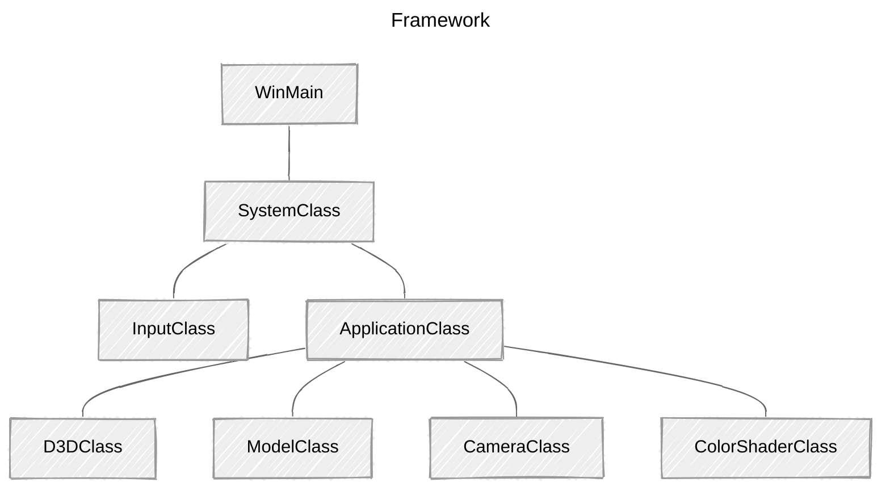

> **📖 참고자료**
>
> * [RasterTek - DirectX 11 on Windows 10 Tutorials](https://rastertek.com/tutdx11win10.html)
> * [Microsoft Learn - Direct3D 11 그래픽](https://learn.microsoft.com/ko-kr/windows/win32/api/_direct3d11/)
> 
> <br>
> 
> **🖥️ 개발환경**
> 
> *   Window 11
> *   Visual Studio 2022

<br>

## 개요

DirectX11에서 버텍스 및 픽셀 셰이더를 작성하는 방법을 소개한다. 버텍스 버퍼, 인덱스 버퍼를 사용하는 방법도 함께 다룬다. 3D 그래픽을 렌더링하기 위해 반드시 이해하고 활용해야 하는 기본적인 개념이다.

<br>

### 버텍스 버퍼 (Vertex Buffers)

{: .normal } {: .normal }

 

<br>

예를 들어, 3D 구 모델은 실제로 수백 개의 삼각형으로 구성되어 있다.`	`

구 모델의 각 삼각형에는 세 개의 점이 있고, 각 점을 정점(vertex)이라고 한다. 구면 모델을 렌더링하려면, 구를 구성하는 모든 정점을 버텍스 버퍼라고 하는 특수한 데이터 배열에 저장해야 한다. 구 모델의 모든 점이 버텍스 버퍼에 저장되면, GPU로 전송해 모델을 렌더링할 수 있다.

<br>

### 인덱스 버퍼 (Index Buffers)

인덱스 버퍼는 정점 버퍼와 관련이 있다. 인덱스 버퍼는 버텍스 버퍼에 있는 각 정점을 기록하는 것을 목표로 한다. GPU는 인덱스 버퍼를 사용해 버텍스 버퍼에서 특정 정점을 빠르게 찾을 수 있게 된다.

인덱스 버퍼의 개념은 책에서 인덱스를 사용하는 것과 유사하다. 빠른 속도로 특정 내용을 찾는데 도움을 주는 역할!

DirectX 문서에 따르면, 인덱스 버퍼를 사용하면 비디오 메모리의 더 빠른 위치에 버텍스 버퍼를 캐싱할 가능성 역시 증가한다. 인덱스 버퍼를 사용하는 것이 성능 면에서도 더 바람직하다.

<br>

### 버텍스 셰이더 (Vertex Shaders)

버텍스 셰이더는 주로 버텍스 버퍼의 정점을 3D 공간으로 변환하기 위해 작성된 작은 프로그램이다. 각 정점의 법선 벡터를 계산하는 등 계산 작업도 수행할 수 있다. 

정점 셰이더는 버텍스 버퍼에서 처리해야 하는 각 정점마다 GPU에 의해 호출된다. 

e.g.) 5,000개의 폴리곤 모델을 렌더링할 경우, GPU는 프레임 당 15,000번 버텍스 셰이더를 실행한다. 만약, 프로그램을 60fps로 고정시키면, 5,000개의 삼각형을 그리기 위해 초당 900,000 번 정점 셰이더를 실행한다.

따라서, 버텍스 셰이더를 효율적으로 작성하는 것이 중요하다.

<br>

### 픽셀 셰이더 (Pixel Shaders)

픽셀 셰이더는 폴리곤을 채색하기 위해 작성된 작은 프로그램이다. GPU가 화면에 그려질 각 픽셀마다 픽셀 셰이더를 실행한다. 채색, 텍스처링, 조명 효과 등 대부분의 효과는 픽셀 셰이더에서 처리한다. 

픽셀 셰이더 역시 GPU에서 호출되는 횟수가 많아지므로, 효율적으로 작성해야 한다.

<br>

### HLSL (High-Level Shader Language)

HLSL은 DX11에서 버텍스/픽셀 셰이더 프로그램을 코딩하는데 사용하는 언어이다. 문법은 C와 거의 동일하지만, 일부 사전 정의된 타입*(pre-defined types)*이 있다.

HLSL 프로그램 파일은 전역 변수, 타입 정의, 버텍스 셰이더, 픽셀 셰이더, 지오메트리 셰이더로 구성되어 있다.

이번 튜토리얼에선 DirectX 11을 사용해 아주 간단한 HLSL 프로그램을 작성한다.

<br>

---

## Updated Framework




ApplicationClass에 세 개의 클래스를 추가한다.

*   CameraClass

    *   뷰 행렬 관리
    *   월드에서의 카메라 위치 처리
    *   셰이더가 렌더링할 때, 카메라의 위치와 방향 정보*(사용자가 씬을 어디에서 보고 있는지)*를 전달

*   ModelClass

    *   3D 모델의 지오메트리 처리

        *(이 튜토리얼에서는 단순성을 위해 단일 삼각형을 다룬다.)*

*   ColorShaderClass
    *   HLSL 셰이더를 호출해 모델을 화면에 렌더링

<br>

---

## Color.vs

**셰이더 (Shader)**

*   모델을 렌더링하는 작은 프로그램 
*   HLSL으로 작성
    *   `.vs`*(버텍스 셰이더)*, `ps`*(픽셀 셰이더)* 소스 파일에 저장
    *   VS에서 새 필터/폴더를 만들어 관리
    *   Preperties 설정 *(설정하지 않을 경우 컴파일 오류 발생)*
        *   Excluded From Build:`Yes`
        *   Contents: `(공란)`
        *   Item Type: `Does not participate in build`

<br>

### Globals

```c++
/* Filename: color.vs */

/////////////
/* GLOBALS */
/////////////

cbuffer MatrixBuffer
{
	matrix worldMatrix;
	matrix viewMatrix;
	matrix projectionMatrix;
};
```

셰이더 프로그램은 전역 변수로 시작한다.

*   C++ 코드에서 값 변경 가능
    *   셰이더 프로그램에서  `int`, `float` 등 다양한 변수 사용 가능
*   일반적으로 HLSL은 전역 변수를 `cbuffer` 버퍼 객체에 저장 *(Constant Buffer)*
    *   단일 전역 변수도 해당 버퍼에 저장
    *   왜? 셰이더를 효율적으로 실행, GPU가 버퍼를 저장하는 방식을 최적화함

본 예제는 세 개의 행렬을 프레임마다 동시에 업데이트할 것이므로, 모두 동일한 버퍼에 작성한다.

<br>

### Typedefs

```c++
//////////////
/* TYPEDEFS */
//////////////

struct VertexInputType
{
	float position : POSITION;
	float4 color : COLOR;
};

struct PixelInputType
{
	float4 position : SV_POSITION;
	float4 color : COLOR;
};
```

**사용자 정의 타입 (Type Definitions)** 

*   C와 유사하게 Typedef 생성 가능!
    *   HLSL에서 사용할 수 있는 `float4` 등의 다양한 데이터 타입 사용
        *   셰이더 프로그래밍을 더 쉽게 읽고 쓸 수 있도록 함

*예제 코드 설명*

*   데이터 타입

    *   `x`, `y`, `z`, `w`: 위치 벡터*(좌표값)*

    *   `red`, `green`, `blue`, `alpha`: 색상값

*   시맨틱(*Semantic*)
    *   `POSITION`: 버텍스 셰이더에서 쓰임
    *   `SV_POSITION`: 픽셀 셰이더에서 쓰임
    *   `COLOR`: 버텍스 셰이더와 픽셀 셰이더 모두 쓰임

*=> 버텍스 셰이더와 픽셀 셰이더에서 쓰이는 시맨틱이 다르므로, 구조체를 따로 만들어야 한다!*

같은 유형을 두 개 이상 원할 경우, `COLOR0`, `COLOR1` 등 숫자를 추가한다.

<br>

### Vertex Shader

```c++
///////////////////
/* Vertex Shader */
///////////////////

PixelInputType ColorVertexShader(VertexInputType input)
{
	PixelInputType output;

	// 올바른 행렬 계산을 위해 위치 벡터를 4차원으로 확장
	input.position.w = 1.0f;

	// 월드, 뷰, 프로젝션 행렬을 통해 정점의 위치 변환(정점 위치 계산)
	output.position = mul(input.position, worldMatrix);
	output.position = mul(input.position, viewMatrix);
	output.position = mul(input.position, projectionMatrix);

	// 픽셀 셰이더가 사용할 input color 저장
	output.color = input.color;

	return output;
}
```

**Vertex Shader**: GPU가 버텍스 버퍼를 받아, 해당 데이터를 처리할 때 호출됨

*   `ColorVertexShader`는 버텍스 버퍼의 모든 정점에 대해 한 번씩 호출됨
*   입력값
    *   버텍스 버퍼의 데이터 타입, 셰이더 소스 파일에서 정의한 구조체 타입과 일치해야 함
    *   *(예제의 경우, `VertexInputType`)*
*   출력값
    *   버텍스 셰이더의 출력 데이터는 픽셀 셰이더로 전송됨
    *   *(예제의 경우, `PixelInputType`)*

<br>

위 내용을 고려하면, 버텍스 셰이더가 `PixelInputType` 유형의 출력 변수(`output`)를 생성한다는 것을 알 수 있다.

**이후 단계**

1.   입력 정점의 위치를 가져와 월드 ➡️ 뷰 ➡️ 투영 행렬에 곱함
     *   정점이 3D 공간에서, 시점에 맞춰 올바른 위치로 배치됨
     *   이후, 2D 화면에 렌더링
2.   출력 데이터가 입력 데이터의 색상값 복사
     *   픽셀 셰이더에 대한 입력으로 사용됨*(반환값)*

주의할 점: 입력 위치(`input.position`)의 W 좌표를 1.0으로 설정해야 한다.

*   입력 데이터는 XYZ 좌표만 받기 때문!
*   행렬 연산 시 `w`값이 없으면 오류가 생길 수 있으므로, 위치 벡터를 4차원으로 확장해야 함

<br>

---

## Color.ps


```c++
/* Filename: color.vs */

//////////////
/* TYPEDEFS */
//////////////

struct PixelInputType
{
	float4 position : SV_POSITION;
	float4 color : COLOR;
};


//////////////////
/* Pixel Shader */
//////////////////

float4 ColorPixelShader(PixelInputType input) : SV_TARGET
{
	return input.color;
}
```

**픽셀 셰이더 (Pixel Shader)**

* 화면에 렌더링할 폴리곤의 픽셀을 그림
  * 입력값: `PixelInputType`
  * 출력값: 최종 픽셀 색상을 나타내는 `float4` 형식
* 픽셀 셰이더 프로그램 동작
  * 입력받은 `color`을 그대로 반환해 픽셀 색칠
  * 버텍스 셰이더의 **출력값으로 전달**받은 색상을 픽셀 셰이더에 그대로 적용

<br>

> 🌱 변수 정리
>
> * `SV_POSITION`: 스크린 좌표값 *(Screen Position)*
> * `COLOR`: 색상값
> * `SV_TARGET`: 출력된 색상이 렌더 타겟에 저장

<br>

---

## Colorshaderclass.h


**Color Shader Class**는 GPU에서 3D 모델을 렌더링할 수 있도록 HLSL 셰이더를 실행한다.

```c++
#ifndef _COLORSHADERCLASS_H_
#define _COLORSHADERCLASS_H_

/////////////
/* INCLUDE */
/////////////

#include <d3d11.h>
#include <d3dcompiler.h>
#include <DirectXMath.h>
#include <fstream>

using namespace DirectX;
using namespace std;
```

```c++
//////////////////////////////////
/* Class name: ColorShaderClass */
//////////////////////////////////

class ColorShaderClass
{
private:
	struct MatrixBufferType
	{
		XMMATRIX world;
		XMMATRIX view;
		XMMATRIX projection;
	};

public:
	ColorShaderClass();
	ColorShaderClass(const ColorShaderClass&);
	~ColorShaderClass();
```

* `MatrixBufferType`: 버텍스 셰이더와 함께 사용할 상수 버퍼(`cbuffer`) 타입 정의
  * 모델 데이터를 올바르게 렌더링하기 위해 셰이더의 typedef와 일치해야 함
    * 구조체의 데이터 구조와 순서가 모두 동일 (*color.vs*의 `MatrixBuffer` 구조체)

<br>

> 🌱 왜 셰이더와 cpp의 구조체가 같아야 할까?
>
> c++에서 구현한 데이터를 GPU로 전송할 때, 셰이더에 정의된 `cbuffer` 구조체와 일치하지 않으면, 데이터가 올바르게 매핑되지 않을 수 있다.
>
> => 렌더링 오류나 크래시가 발생할 수 있다!
>
> <br>
>
> cpp와 셰이더를 일치시키기 위해선 **패킹 규칙**, **메모리 정렬 순서**를 지켜야 한다. 
>
> 또한, 일반적으로 HLSL은 데이터가 16byte를 넘지 않도록 한다.
>
> * 데이터가 four-component vector(`float4`) 단위로 정렬
>
>   * 구조체의 크기가 항상 16byte의 배수가 됨
>
>   * *cpp에서 구조체를 작성할 때는, 별도의 패딩 변수를 작성해야 한다!*
>
>     ```c++
>     /* 구체 구현 중 상수 버퍼 */
>     struct FConstants
>     {
>         // float3 + float => 16
>         FVector3 Offset; // c0.xyz (12바이트) + 내부 패딩
>         float Scale; // c0.w
>                                                         
>         // float 4개 => 16
>         float Rotation; // c1.x
>         float padRot0; // c1.y
>         float padRot1; // c1.z
>         float padRot2; // c1.w
>                                                         
>         // float4 => 16
>         FFloat4 NewColor; // c2
>                                                         
>         // int 4개 => 16 바이트
>         int ChangeColor; // c3.x
>         int pad1; // c3.y
>         int pad2; // c3.z
>         int pad3; // c3.w
>     };
>     ```
>
> <br>
>
> 📖*참고*
>
> [[Packing rules for constant variables](https://learn.microsoft.com/en-us/windows/win32/direct3dhlsl/dx-graphics-hlsl-packing-rules?utm_source=chatgpt.com)]

<br>

```c++
	bool Initialize(ID3D11Device*, HWND);
	void Shutdown();
	bool Render(ID3D11DeviceContext*, int, XMMATRIX, XMMATRIX, XMMATRIX);

private:
	bool InitializeShader(ID3D11Device*, HWND, WCHAR*, WCHAR*);
	void ShutdownShader();
	void OutputShaderErrorMessage(ID3D10Blob*, HWND, WCHAR*);

	bool SetShaderParameters(ID3D11DeviceContext*, XMMATRIX, XMMATRIX, XMMATRIX);
	void RenderShader(ID3D11DeviceContext*, int);

private:
	ID3D11VertexShader* m_vertexShader;	// 버텍스 셰이더 객체
	ID3D11PixelShader* m_pixelShader;	// 픽셀 셰이더 객체
	ID3D11InputLayout* m_layout;		// 입력 레이아웃((Vertex Input Layout))
	ID3D11Buffer* m_matrixBuffer;		// 행렬 데이터를 저장하는 상수 버퍼
};

#endif
```

**셰이더의 초기화와 종료를 처리하는 함수**

* 인터페이스
  * `Initialize`: 셰이더 초기화
  * `Shutdown`: 셰이더 종료, 리소스 정리
  * `Render`: 셰이더 파라미터를 설정한 후, 셰이더를 사용해 모델 정점 렌더링
* 내부 함수
  * `InitializeShader`: 셰이더 로드 및 컴파일
  * `ShutdownShader`: 셰이더 종료, 리소스 정리
  * `OutputShaderErrorMessage`: 셰이더 컴파일 오류가 발생하면 메시지 출력
  * `SetShaderParameters`: 셰이더에서 필요한 파라미터 설정
  * `RenderShader`:GPU가 실제로 셰이더를 실행해 모델 렌더링 작업 수행

<br>

---

## Colorshaderclass.cpp

```c++
////////////////////////////////////
/* Filename: colorshaderclass.cpp */
////////////////////////////////////

#include "colorshaderclass.h"

ColorShaderClass::ColorShaderClass()
{
	m_vertexShader = 0;
	m_pixelShader = 0;
	m_layout = 0;
	m_matrixBuffer = 0;
}

ColorShaderClass::ColorShaderClass(const ColorShaderClass&)
{
}

ColorShaderClass::~ColorShaderClass()
{
}
```

클래스 생성자에서 private 포인터를  null로 설정한다.

<br>

### Initialize/Shutdown

**ColorShaderClass::Initialize**

```c++
bool ColorShaderClass::Initialize(ID3D11Device* device, HWND hwnd)
{
	bool result;
	wchar_t vsFilename[128];
	wchar_t psFilename[128];
	int error;

	// 버텍스 셰이더 파일명 설정
	error = wcscpy_s(vsFilename, 128, L"../Engine/color.vs");
	if (error != 0)
	{
		return false;
	}

	// 픽셀 셰이더 파일명 설정
	error = wcscpy_s(psFilename, 128, L"../Engine/color.ps");
	if (error != 0)
	{
		return false;
	}

	// 버텍스/픽셀 셰이더 초기화
	result = InitializeShader(device, hwnd, vsFilename, psFilename);
	if (!result)
	{
		return false;
	}

	return true;
}
```


* 셰이더 초기화 함수(`InitializeShader`) 호출
  * HLSL 셰이더 파일명 전달(`color.vs`, `color.ps`)
    * `wcscpy_s` 함수를 사용해 파일명을 안전하게 복사
    * 오류 발생 시 `false` 반환

<br>

**ColorShaderClass::Shutdown**

```c++
void ColorShaderClass::Shutdown()
{
	// 버텍스/픽셀 셰이더와 관련 객체 모두 종료
	ShutdownShader();

	return;
}
```

* 셰이더 종료 함수(`ShutdownShader`) 호출

<br>

### Render

```c++
bool ColorShaderClass::Render(ID3D11DeviceContext* deviceContext, int indexCount, XMMATRIX worldMatrix, XMMATRIX viewMatrix, XMMATRIX projectionMarix)
{
	bool result;

	// 렌더링에 사용할 매개변수 설정
	result = SetShaderParameters(deviceContext, worldMatrix, viewMatrix, projectionMarix);
	if (result)
	{
		return false;
	}

	// 준비된 버퍼를 셰이더로 렌더링
	RenderShader(deviceContext, indexCount);

	return true;
}
```

* `SetShaderParameters` 함수를 사용해 셰이더 내부의 매개변수 설정
  * `SetShaderParameters`: 행렬과 같은 변환 데이터를 셰이더에 전달
* 매개변수 설정 후`RenderShader` 함수를 호출
  * `RenderShader`: 설정된 매개변수를 기반으로 GPU에 Draw Call 요청
  * *HLSL 셰이더를 사용해 녹색 삼각형 그릴 예정!*

<br>

### InitializeShader

#### 변수 정의/초기화

```c++
bool ColorShaderClass::InitializeShader(ID3D11Device* device, HWND hwnd, WCHAR* vsFilename, WCHAR* psFilename)
{
	HRESULT result;

	ID3D10Blob* errorMessage;
	ID3D10Blob* vertexShaderBuffer;
	ID3D10Blob* pixelShaderBuffer;

	D3D11_INPUT_ELEMENT_DESC polygonLayout[2];
	unsigned int numElements;
	D3D11_BUFFER_DESC matrixBufferDesc;

	// 함수에서 사용할 포인터를 null 초기화
	errorMessage = 0;
	vertexShaderBuffer = 0;
	pixelShaderBuffer = 0;
```

**ColorShaderClass::InitializeShader**

* 셰이더 파일을 실제로 로드해 DirectX와 GPU가 사용할 수 있도록 설정하는 역할
  * `.vs`, `.ps` 파일을 DirectX에 로드하고 컴파일

* 레이아웃 설정, 버텍스 버퍼 데이터가 GPU 그래픽 파이프라인에서 처리되는 과정 확인 가능
  * 셰이더를 파이프라인에 연결해 렌더링 준비
* 레이아웃은 `modelclass.h`, `color.vs` 파일에 정의된 VertexType과 일치해야 함 *(렌더링 오류 방지)*
  * 버텍스 데이터 구조 정의 => GPU가 제대로 해석할 수 있도록!
    * 버텍스 구조체와 HLSL 셰이더의 입력 구조체 간 다리 역할 
  * `POSITION`, `COLOR`과 같은 셰이더의 input semantic과 일치해야 함

<br>

> 🌱 `Input Layout` vs `Constant Buffer`
>
> **Input Layout**
>
> * 버텍스 셰이더 스테이지에서, GPU가 버텍스 데이터를 다룰 수 있도록 데이터의 형식, 읽어야 하는 방식 등을 정의
> * 버텍스 버퍼에 저장된 데이터 구조 설명*(구조체)*
>   * 버텍스 셰이더의 입력 변수(`POSITION`, `COLOR` 등)와 연결
> * 해당 버텍스 데이터는 정점마다 GPU로 전달
>
> **Constant Buffer**
>
> * 전역 변수, 행렬, 조명 등 렌더링을 위한 데이터를 GPU의 모든 셰이더 단계에 전달
>
>   * 프레임마다 변하는 데이터를 GPU로 전달!
>
>     cf) 정점마다x, 전체 렌더링에 적용
>
> <br>
>
> 🌱  `Input Layout` vs `Input Assembler`
>
> **Input Assembler**
>
> * 버텍스/인덱스 버퍼에서 데이터 읽어들임
>   * 버텍스 셰이더로 전달 => 일종의 데이터 전달자 역할!
>
> **input layout과 IA stage의 관계**
>
> 입력 레이아웃이 버텍스 데이터의 구조와 형식을 정의하면 -> IA가 얘를 보고 실제 데이터를 해석한 후, 셰이더로 전달한다.
>
> 만약, 입력 레이아웃이 없다면 GPU는 버텍스 데이터를 어떻게 해석해야 할지 모른다!

<br>

#### 셰이더 컴파일

```c++
        // 버텍스 셰이더 코드 컴파일
        result = D3DCompileFromFile(vsFilename, NULL, NULL, "ColorVertexShader", "vs_5_0", D3D10_SHADER_ENABLE_STRICTNESS, 0, &vertexShaderBuffer, &errorMessage);
        if (FAILED(result))
        {
            // 셰이더 컴파일에 실패하면 오류 메시지에 정보 저장
            if (errorMessage)
            {
                OutputShaderErrorMessage(errorMessage, hwnd, vsFilename);
            }
            // 오류 메시지가 없다면, 셰이더 파일 자체를 찾을 수 없다는 의미
            else
            {
                MessageBox(hwnd, vsFilename, L"Missing Shader File", MB_OK);
            }

            return false;
        }

        // 픽셀 셰이더 코드 컴파일
        result = D3DCompileFromFile(psFilename, NULL, NULL, "ColorPixelShader", "ps_5_0", D3D10_SHADER_ENABLE_STRICTNESS, 0, &pixelShaderBuffer, &errorMessage);
        if (FAILED(result))
        {
            // 셰이더 컴파일에 실패하면 오류 메시지에 정보 저장
            if (errorMessage)
            {
                OutputShaderErrorMessage(errorMessage, hwnd, psFilename);
            }
            // 오류 메시지가 없다면, 셰이더 파일 자체를 찾을 수 없다는 의미
            else
            {
                MessageBox(hwnd, psFilename, L"Missing Shader File", MB_OK);
            }

            return false;
        }

    }
```

셰이더 프로그램을 버퍼로 컴파일한다.

* 전달할 값
  * 셰이더 파일 이름, 함수 이름, 셰이더 버전(DX11의 경우 5.0), 셰이더를 컴파일한 결과를 저장할 버퍼 
* 컴파일에 실패할 경우
  * 오류 메시지(`errorMessage`)에 컴파일 오류 내용 저장
    * 저장한 메시지는 `OutputShaderErrorMessage` 함수에 전달되어 출력됨
  * 오류 메시지가 없는 경우
    * 셰이더 파일 자체를 찾을 수 없음
      * 메시지 박스를 팝업해 알림 (*"Missing Shader File"*)

<br>

```c++
	// 컴파일된 버퍼에 버텍스 셰이더 생성
	result = device->CreateVertexShader(
        vertexShaderBuffer->GetBufferPointer(), 	// 셰이더 bytecode 포인터
        vertexShaderBuffer->GetBufferSize(), 		// bytecode 크기
        NULL,	// 사용자 정의 클래스
        &m_vertexShader		// 생성된 셰이더 오브젝트를 저장할 포인터
    );

	if (FAILED(result))
	{
		return false;
	}

	// 컴파일된 버퍼에 픽셀 셰이더 생성
	result = device->CreatePixelShader(pixelShaderBuffer->GetBufferPointer(), pixelShaderBuffer->GetBufferSize(), NULL, &m_pixelShader);
	if (FAILED(result))
	{
		return false;
	}
```

버텍스/픽셀 셰이더 코드가 성공적으로 버퍼에 컴파일된 후, 해당 버퍼를 사용해 셰이더 오브젝트를 생성한다. 

이후, 포인터를 사용해 버텍스 셰이더, 픽셀 셰이더와 상호작용(interface)하게 된다.

<br>

> 🌱 `Bytecode` vs `Buffer Pointer`
>
> [**바이트 코드**](https://ko.wikipedia.org/wiki/%EB%B0%94%EC%9D%B4%ED%8A%B8%EC%BD%94%EB%93%9C)
>
> * 가상 컴퓨터에서 돌아가는 실행 프로그램을 위한 이진 표현법 
>
>   * 소스 코드를 컴파일러가 바이트 코드로 변환
>
>     => HLSL 코드를 GPU가 이애할 수 있도록 컴파일한 결과!
>
>   * GPU는 바이트코드만 인식하고 실행 가능
>
> **버퍼 포인터**
>
> * 메모리 주소값을 가리킨 포인터
> * 포인터는 주소값을 가리키지만, 데이터의 의미를 설명할 수 x
>
> <br>
>
> `GetBufferPointer()` 함수 자체는 버퍼 포인터를 반환하지만, 
>
> `vertexShaderBuffer->GetBufferPointer()` 는 GPU가 읽어들일 수 있도록 컴파일된 셰이더 객체를 가리키고 있으므로, 맥락상 바이트 코드라고 하는 것이 정확하다!

<br>

#### 레이아웃 생성

```c++
	// Vertex Input Layout Desc 생성
	// ModelClass, 셰이더의 VertexType 구조체와 일치해야 함
	polygonLayout[0].SemanticName = "POSITION";
	polygonLayout[0].SemanticIndex = 0;
	polygonLayout[0].Format = DXGI_FORMAT_R32G32B32_FLOAT;
	polygonLayout[0].InputSlot = 0;
	polygonLayout[0].AlignedByteOffset = 0;
	polygonLayout[0].InputSlotClass = D3D11_INPUT_PER_VERTEX_DATA;
	polygonLayout[0].InstanceDataStepRate = 0;

	polygonLayout[1].SemanticName = "COLOR";
	polygonLayout[1].SemanticIndex = 0;
	polygonLayout[1].Format = DXGI_FORMAT_R32G32B32A32_FLOAT;
	polygonLayout[1].InputSlot = 0;
	polygonLayout[1].AlignedByteOffset = D3D11_APPEND_ALIGNED_ELEMENT;
	polygonLayout[1].InputSlotClass = D3D11_INPUT_PER_VERTEX_DATA;
	polygonLayout[1].InstanceDataStepRate = 0;
```

셰이더 코드를 컴파일한 후, 셰이더가 처리할 버텍스 데이터의 레이아웃을 생성한다.

이 셰이더는 Position과 Color 벡터를 사용하므로, 레이아웃에 두 가지 요소를 정의하고 각 크기를 지정해야 한다.

**Semantic Name**: 셰이더가 해당 요소의 용도를 판단할 수 있도록 도와준다.

* POSITION: 첫 번째 요소(`polygonLayout[0]`)에 사용 
* COLOR: 두 번째 요소(`polygonLayout[1]`)에 사용

**FORMAT**

* POSITION 벡터: `DXGI_FORMAT_R32G32B32_FLOAT` *(채널 당 32비트인 3개의 float값)*
* COLOR벡터: `DXGI_FORMAT_R32G32B32_FLOAT` *(채널 당 32비트인 4개의 float값)*

**AlignedByteOffset**: 각 요소가 버퍼 내에서 시작되는 위치를 알림 *(byte 단위)*

* 첫 12byte: `POSITION` 데이터 *(=> 오프셋 0)*
* 다음 16byte: `COLOR` 데이터 *(=> 자동 배치)*
* `D3D11_APPEND_ALIGNED_ELEMENT`: DirectX가 자동으로 오프셋 계산
  * 오프셋 값을 직접 입력하지 않을 경우 사용

이외의 설정들은 현재 튜토리얼에서 필요하지 않으므로, default값으로 설정한다.

<br>

>🌱 [**D3D11_INPUT_ELEMENT_DESC 구조체**](https://learn.microsoft.com/ko-kr/windows/win32/api/d3d11/ns-d3d11-d3d11_input_element_desc)
>
>```c++
>typedef struct D3D11_INPUT_ELEMENT_DESC {
>  LPCSTR                     SemanticName;		// 셰이더에서 해당 데이터의 용도 지정(GPU가 데이터를 구분할 수 있는 이름표!)
>  UINT                       SemanticIndex;		// 같은 시맨틱을 구분하기 위한 인덱스
>  DXGI_FORMAT                Format;			// 데이터 형식(`DXGI_FORMAT`)
>  UINT                       InputSlot;			// 데이터가 저장된 버퍼 슬롯
>  UINT                       AlignedByteOffset;		// 데이터가 버퍼 내부에서 시작되는 위치
>  D3D11_INPUT_CLASSIFICATION InputSlotClass;		// 데이터가 정점 기반(개별)인지, 인스턴스 기반(반복 사용)인지 구분
>  UINT                       InstanceDataStepRate;	// 인스턴스 데이터의 업데이트 주기
>} D3D11_INPUT_ELEMENT_DESC;
>```
>
><br>
>
>

<br>

```c++
	// 레이아웃 요소의 개수 가져옴 
	numElements = sizeof(polygonLayout) / sizeof(polygonLayout[0]);

	// 버텍스 입력 레이아웃 생성
	result = device->CreateInputLayout(polygonLayout, numElements, vertexShaderBuffer->GetBufferPointer(), vertexShaderBuffer->GetBufferSize(), &m_layout);
	if (FAILED(result))
	{
		return false;
	}

	// 더 이상 필요하지 않은 버텍스/픽셀 셰이더 버퍼 해제
	vertexShaderBuffer->Release();
	vertexShaderBuffer = 0;

	pixelShaderBuffer->Release();
	pixelShaderBuffer = 0;
```

레이아웃 설명을 설정한 후, 디바이스 요소의 개수를 구하고 D3D 디바이스를 사용해 입력 레이아웃을 생성할 수 있다. 

입력 레이아웃이 생성되고 나면 더이상 필요하지 않은 버텍스 셰이더 버퍼와 픽셀 셰이더 버퍼를 해제한다.

<br>

#### 상수 버퍼 생성

```c++
	// 버텍스 셰이더의 dynamic matritx constant buffer desc 생성
	matrixBufferDesc.Usage = D3D11_USAGE_DYNAMIC;
	matrixBufferDesc.ByteWidth = sizeof(MatrixBufferType);
	matrixBufferDesc.BindFlags = D3D11_BIND_CONSTANT_BUFFER;
	matrixBufferDesc.CPUAccessFlags = D3D11_CPU_ACCESS_WRITE;
	matrixBufferDesc.MiscFlags = 0;
	matrixBufferDesc.StructureByteStride = 0;

	// 상수 버퍼 포인터를 생성해 클래스가 버텍스 셰이더 상수 버퍼에 접근할 수 있도록 함
	result = device->CreateBuffer(&matrixBufferDesc, NULL, &m_matrixBuffer);
	if (FAILED(result))
	{
		return false;
	}

	return true;
}
```

셰이더를 활용하기 위해, 마지막으로 상수 버퍼를 설정한다.

버텍스 셰이더에서 확인했듯이, 현재는 상수 버퍼가 한 개만 있으므로 셰이더와 인터페이스 할 수 있도록 desc를 한 개 설정한다.

* `Usage`는 dynamic으로 설정

  * 프레임마다 상수 버퍼를 업데이트해야 하기 때문!

    *카메라 위치, 모델 회전, 이동 행렬값 등 매번 동적으로 변하는 데이터를 처리하기 위함*

* `BindFlags`가 해당 버퍼를 상수 버퍼임을 나타냄

* `CPUAccessFlags`는 사용 유형에 맞춰 설정해야 함

  * `D3D11_CPU_ACCESS_WRITE`로 설정해 CPU가 버퍼에 데이터를 쓸 수 있도록 함

* desc 설정이 완료된 후, 상수 버퍼 인터페이스 생성(`CreateBuffer`)

  * 이후 `SetShaderParameters` 함수를 사용해 셰이더의 내부 변수에 접근

<br>


> 🌱 [**D3D11_BUFFER_DESC**](https://learn.microsoft.com/ko-kr/windows/win32/api/d3d11/ns-d3d11-d3d11_buffer_desc)
>
> ```c++
> typedef struct D3D11_BUFFER_DESC {
>   UINT        ByteWidth;		// 버퍼(구조체)의 크기
>   D3D11_USAGE Usage;			// 버퍼 사용 유형(dynamic->프레임마다 업데이트)
>   UINT        BindFlags;		// 어떤 파이프라인 스테이지의 버퍼로 바인딩할지 결정
>   UINT        CPUAccessFlags;		// 해당 리소스에 허용되는 CPU의 액세스 유형
>   UINT        MiscFlags;		// 기타 리소스 옵션
>   UINT        StructureByteStride;	// 구조화된 버퍼일 경우 사용(버퍼 구조의 각 요소 크기)
> } D3D11_BUFFER_DESC;
> ```
>
> <br>
>
> 🌱 [**상수 버퍼**](https://learn.microsoft.com/ko-kr/windows/win32/direct3d11/overviews-direct3d-11-resources-buffers-intro#constant-buffer)
>
> * 셰이더 상수 데이터를 효율적으로 제공할 수 있도록 구성된 버퍼
>
>   * 구조체 형태로 사용 가능
>
>     * 단, 읽기 전용
>
>       *(셰이더 내부에서 수정x, CPU가 데이터를 업데이트한 후 전달)*
>
>   * 여러 상수 데이터를 한 번에 묶어 GPU에 전달 => 메모리 전송 효율 높임
>
>   * GPU는 데이터를 16byte 단위로 정렬해 빠르게 접근 및 처리
>
> * 셰이더에 전달할 데이터 저장*(버텍스/픽셀/지오메트리 등)*
>
>   * 프레임마다 변하는 행렬, 카메라 등 자주 변경되는 데이터 관리
>   * 셰이더는 해당 데이터를 받아 버텍스/픽셀 등의 연산에 활용
>
> 🌱 `device->CreateBuffer(&matrixBufferDesc, NULL, &m_matrixBuffer);`
>
> * `matrixBufferDesc`에 정의된 속성을 기반으로 상수 버퍼 생성
>
>   * `m_matrixBuffer` 포인터가 해당 버퍼를 가리킴. 
>
>     *(초기 데이터는 없으므로 `NULL` 설정)*
>
> * 이후, `m_matrixBuffer` 변수를 통해 셰이더 내부의 상수 변수에 접근

<br>

---

### ShutdownShader

```c++
void ColorShaderClass::ShutdownShader()
{
	// 행렬 상수 버퍼 해제
	if (m_matrixBuffer)
	{
		m_matrixBuffer->Release();
		m_matrixBuffer = 0;
	}

	// 레이아웃 해제
	if (m_layout)
	{
		m_layout->Release();
		m_layout = 0;
	}

	// 픽셀 셰이더 해제
	if (m_pixelShader)
	{
		m_pixelShader->Release();
		m_pixelShader = 0;
	}

	// 버텍스 셰이더 해제
	if (m_vertexShader)
	{
		m_vertexShader->Release();
		m_vertexShader = 0;
	}

	return;
}
```

**ColorShaderClass::ShutdownShader**

* `InitializeShader` 함수에서 생성한 4개의 인터페이스 해제

<br>

---

### OutputShaderErrorMessage

```c++
void ColorShaderClass::OutputShaderErrorMessage(ID3D10Blob* errorMessage, HWND hwnd, WCHAR* shaderFilename)
{
	char* compileErrors;
	unsigned long long bufferSize, i;
	ofstream fout;

	// 오류 메시지 텍스트 버퍼에 대한 포인터
	compileErrors = (char*)(errorMessage->GetBufferPointer());

	// 메시지 길이
	bufferSize = errorMessage->GetBufferSize();

	// 오류 메시지를 작성할 파일 열기
	fout.open("shader-error.txt");

	// 오류 메시지를 파일에 쓰기
	for(i = 0; i < bufferSize, i++)
	{
		fout << compileErrors[i];
	}

	// 파일 닫기
	fout.close();

	// 오류 메시지 버퍼 해제
	errorMessage->Release();
	errorMessage = 0;

	// 사용자가 컴파일 오류 메시지를 확인하도록 팝업 알림
	MessageBox(hwnd, L"Error compiling shader. Check shader-error.txt for message", shaderFilename, MB_OK);

	return;
}
```

**ColorShaderClass::OutputShaderErrorMessage**

* 버텍스/픽셀 셰이더 컴파일 시 발생한 오류 메시지 출력
* `ID3D10Blob`: 셰이더 컴파일 실패 시 DirectX가 반환하는 오류 메시지 버퍼
  * 오류 메시지를 파일로 저장한 후 사용자 확인 안내

<br>

---

### SetShaderParameters

```c++
bool ColorShaderClass::SetShaderParameters(ID3D11DeviceContext* deviceContext, XMMATRIX worldMatrix, XMMATRIX viewMatrix, XMMATRIX projectionMatrix)
{
	HRESULT result;
	D3D11_MAPPED_SUBRESOURCE mappedResource;	// CPU가 GPU 버퍼에 접근하기 위해 사용하는 구조체
	MatrixBufferType* dataPtr;			// 상수 버퍼 데이터를 가리키는 포인터
	unsigned int bufferNumber;			// 상수 버퍼의 슬롯 번호 
```

**ColorShaderClass::SetShaderParameters**

* 셰이더 전역 변수를 더 쉽게 설정하기 위해 만들어진 함수
* 전역 변수 전송 흐름
  * `ApplicationClass()`에서 변환 행렬 생성 *(월드, 뷰 투영)*
  * `SetShaderParameters()`에서 행렬을 상수 버퍼에 저장
  * `Render()`가 호출하면 버텍스 셰이더로 행렬 전송
    * 상수 버퍼를 버텍스 셰이더와 바인딩(`VSSetConstantBuffers()`)

<br>


#### 행렬 전치

```c++
    // 셰이더로 전달하기 위해 행렬 전치(transpose matrices)
    worldMatrix = XMMatrixTranspose(worldMatrix);
    viewMatrix = XMMatrixTranspose(viewMatrix);
    projectionMatrix = XMMatrixTranspose(projectionMatrix);
```

* 셰이더에 행렬을 전달하기 전에 반드시 행렬을 전치
  * DirectX 11의 필수 요구 사항! 

<br>

> 🌱 왜 전치행렬을 만들어야 할까?
>
> * 행렬을 메모리에 저장하는 방식
>
>   * **DirectX**: 열 우선 *(Column-Major)*
>
>   * **C++**: 행 우선 *(Row-Major)*
>   
>   {: width="300" height="400" .normal }
>
> 
>
> DirectX와 C++이 행렬을 메모리에 배치하는 방식이 서로 다르다! 행렬을 전치한 후 셰이더에 전송해야 GPU가 올바르게 읽어들인다. 만약 c++가 전치 행렬로 전송하지 않으면, 셰이더는 잘못된 렌더링 결과를 반환할 수 있다.
>
> <br>
>
> * 셰이더의 기본값은 열 우선이지만, HLSL에서 동작 방식을 설정할 수 있다!
>   * `row_major`, `column_major` 를 명시적으로 설정 가능
>   * 단, 전치 행렬을 적용하는 것이 일반적인 방법임
>
> <br>
>
> 📖 참고
>
> * [**[Wikipedia]** Row- and column-major order](https://en.wikipedia.org/wiki/Row-_and_column-major_order)
> * [**[MicroSoft Learn]** Per-Component Math Operations - Matrix Ordering](https://learn.microsoft.com/en-us/windows/win32/direct3dhlsl/dx-graphics-hlsl-per-component-math?utm_source=chatgpt.com#matrix-ordering)

<br>


#### 상수 버퍼 잠금 & 행렬 업데이트

```c++
	// 상수 버퍼 Lock -> 데이터 쓰기 가능
	result = deviceContext->Map(m_matrixBuffer, 0, D3D11_MAP_WRITE_DISCARD, 0, &mappedResource);
	if (FAILED(result))
	{
		return false;
	}

	// 상수 버퍼의 데이터에 대한 포인터
	dataPtr = (MatrixBufferType*)mappedResource.pData;

	// 행렬을 상수 버퍼로 복사
	dataPtr->world = worldMatrix;
	dataPtr->view = viewMatrix;
	dataPtr->projection = projectionMatrix;

	// 상수 버퍼 UnLock (-> GPU가 다시 접근할 수 있음!)
	deviceContext->Unmap(m_matrixBuffer, 0);
```

`m_matrixBuffer`를 lock하고 새 행렬을 설정한 후, unlock한다.

<br>

> 🌱 DirectX11의 `Map()`, `Unmap()`
>
> **Map/Unmap VS UpdataSubresource**
>
> * `Map()`
>
>   * CPU가 GPU 리소스(버퍼,텍스처)에 안전하게 접근할 수 있도록 lock 설정
>
>     * 충돌 방지를 위해 GPU의 리소스 접근 제한/새 메모리 공간 할당
>
>       ➡️CPU-GPU 간 병렬 작업 가능!
>
>     * CPU는 버퍼 포인터를 받아 데이터 쓰기
>
>   * `D3D11_MAP_WRITE_DISCARD`
>
>     * GPU가 버퍼를 사용 중이더라도, 기존 데이터 버림(Discard)
>       * 리소스의 이전 콘텐츠가 정의되지x, 쓰기용으로 매핑됨
>     * 새로운 메모리에 데이터 쓰기 수행
>       * CPU가 GPU 작업 완료를 대기하지 않음➡️동기화 지연x
>
> * `Unmap()`
>
>   * 접근한 데이터에 대한 포인터 무효화
>     * 해당 데이터를 GPU가 다시 접근할 수 있음
>
> * *cf)* `UpdateSubresource()`
>
>   * 정적 리소스를 업데이트할 때 사용
>
>     *  (`desc.Usage=D3D11_USAGE_DEFAULT`)
>       * map: `desc.Usage = D3D11_USAGE_DYNAMIC;`➡️동적 데이터 업데이트
>     * 초기 리소스 설정, 자주 변경되지 않는 데이터 복사*(static)*
>     * 동적 리소스를 복사할 때는 map/unmap을 사용!
>
>   * CPU➡️GPU 단방향 메모리 복사*(직접 접근x)*
>
>   * 데이터 크기를 준수해야 함
>
>     * 버퍼 전체 복사: 버퍼-데이터 크기가 일치해야 함
>
>     * 버퍼 일부 복사: 복사 범위 지정 
>
>       (`optional] const D3D11_BOX *pDstBox`: 복사할 하위 리소스 부분 정의)
>
> <br>
>
> **작업 흐름**
>
> 1. GPU➡️프레임 렌더링 수행
> 2. CPU➡️`Map()` 호출 *(버퍼 Lock, 필요한 경우 CPU 캐시를 삭제해 데이터 업데이트)*
> 3. CPU➡️행렬 데이터 복사 *(GPU➡️다른 작업 수행/대기)*
> 4. CPU➡️`Unmap()` 호출 *(버퍼 Unlock)*
> 5. GPU➡️최신 데이터로 렌더링 수행
>
> <br>
>
> 📖 **참고**
>
> [**[Microsoft Learn]** ID3D11DeviceContext::Map](https://learn.microsoft.com/ko-kr/windows/win32/api/d3d11/nf-d3d11-id3d11devicecontext-map)
>
> [**[Microsoft Learn]** ID3D11DeviceContext::Unmap](https://learn.microsoft.com/ko-kr/windows/win32/api/d3d11/nf-d3d11-id3d11devicecontext-unmap)
>
> <br>
>
> [**[Microsoft Learn]** ID3D11DeviceContext::UpdateSubresource](https://learn.microsoft.com/ko-kr/windows/win32/api/d3d11/nf-d3d11-id3d11devicecontext-updatesubresource)
>
> [**[Tistory - DirectX Engine]** [DirectX 11] Map / UnMap vs UpdataSubresource](https://kyuhwang.tistory.com/12)

<br>


#### 상수 버퍼-버텍스 셰이더 바인딩

```c++
	// 버텍스 셰이더에서 상수 버퍼의 위치 설정
	bufferNumber = 0;

	// 버텍스 셰이더의 업데이트된 상수 버퍼 설정
	deviceContext->VSSetConstantBuffers(bufferNumber, 1, &m_matrixBuffer);

	return true;
}
```

업데이트된 행렬 상수 버퍼를 HLSL 버텍스 셰이더에 바인딩한다.

* `VSSetConstantBuffers(버퍼 슬롯 번호, 상수 버퍼 개수, 상수 버퍼 포인터)`
  * 상수 버퍼를 버텍스 셰이더에 바인딩
  * 바인딩된 상수 버퍼는 셰이더 내부에서 전역 변수처럼 접근 가능
  * `bufferNumber`
    * `cbuffer VS_CONSTANT_BUFFER : register(b0) {...};` [구조체와 매핑](https://learn.microsoft.com/ko-kr/windows/win32/direct3d11/overviews-direct3d-11-resources-buffers-constant-how-to)하기 위함
    * `b0`와 `bufferNumber=0`이 연결됨

<br>

---

### RenderShader

```c++
void ColorShaderClass::RenderShader(ID3D11DeviceContext* deviceContext, int indexCount)
{
	// 입력 레이아웃 설정 -> IA 활성화
	deviceContext->IASetInputLayout(m_layout);			// 버텍스 데이터가 IA에서 어떻게 해석될지

	// 삼각형 렌더링에 사용할 버텍스-픽셀 셰이더 설정
	deviceContext->VSSetShader(m_vertexShader, NULL, 0);	// 버텍스 데이터로 3D 공간의 위치 변환
	deviceContext->PSSetShader(m_pixelShader, NULL, 0);		// 변환된 버텍스를 기반으로 픽셀 셰이더 처리

	// DreamIndexed 함수 호출 -> 삼각형 렌더링
	deviceContext->DrawIndexed(indexCount, 0, 0);		// 버텍스 버퍼, 인덱스 버퍼를 사용해 삼각형 렌더링
}
```

**ColorShaderClass::RenderShader**

* `Render` 함수에서 두 번째로 호출

  * `SetShaderParameters` 함수가 먼저 호출
    * 셰이더 파라미터가 정확하게 설정되어 있는지 점검

* 함수 동작 과정

  1. 입력 레이아웃을 input assembler에 활성화
     * GPU가 버텍스 버퍼의 데이터 포맷을 알게 함
  2. 버텍스 버퍼를 그리기 위해 사용할 버텍스 셰이더와 픽셀 셰이더 설정
  3. 셰이더를 설정한 후, `DrawIndexed` 함수를 호출해 삼각형 렌더링

  ➡ 녹색 삼각형이 화면에 렌더링된다!

<br>

> 🌱 지금까지의 렌더링 파이프라인 흐름!
>
>  **I. HLSL 셰이더 컴파일**
>
> 1. **`color.vs`**: 버텍스 셰이더 작성
> 2. **`color.ps`**: 픽셀 셰이더 작성
>
> <br>
>
>  **II. 셰이더 초기화** **`InitializeShader`**
>
> 1. **`D3DCompileFromFile`**: 셰이더 컴파일
> 2. **`CreateVertexShader`**, **`CreatePixelShader`**: 셰이더 객체 생성
> 3. **`CreateInputLayout`**: 입력 레이아웃 생성
>
> <br>
>
> **III. 버퍼 설정 및 데이터 전송** **`SetShaderParameters`**
>
> 1. 상수 버퍼로 행렬 데이터 전송
> 2. GPU에 데이터 업데이트 
>
> <br>
>
> **IV. 렌더링 호출** **`RenderShader`**
>
> 1. **`IASetInputLayout`**: 입력 레이아웃 설정
> 2. **`VSSetShader`**: 버텍스 셰이더 설정
> 3. **`PSSetShader`**: 픽셀 셰이더 설정
> 4. **`DrawIndexed`**: 삼각형 렌더링 명령 호출
>
> <br>
>
> **V. GPU 그래픽 파이프라인**
>
> 1. **`Input Assembler`**: 버텍스 데이터를 primitive로 조합
> 2. **`Vertex Shader`**: 버텍스에 변환 행렬을 적용해 3D 공간상 위치 계산
> 3. **`Rasterizer`**: 3D 데이터를 2D 화면에 맞게 픽셀 단위로 분할
> 4. **`Pixel Shader`**: 픽셀에 색상, 텍스처, 조명 등 효과 적용
> 5. **`Output Merger`**: 픽셀 데이터를 프레임 버퍼에 병합➡️화면 출력

<br>

---

## Modelclass.h

```c++
////////////////////////////
/* Filename: modelclass.h */ 
////////////////////////////

#ifdef  _MODELCLASS_H_
#define _MODELCLASS_H_


//////////////
/* INCLUDES */
//////////////
#include <d3d11.h>
#include <directxmath.h>
using namespace DirectX;

class ModelClass
{
```


ModelClass는 3D 모델의 지오메트리를 캡슐화하는 역할을 담당한다. 

이번 튜토리얼에서는 녹색 삼각형 데이터를 수동으로 설정한다.  또, 삼각형이 그려질 수 있도록 버텍스 버퍼와 인덱스 버퍼를 생성한다.

<br>

```c++
private:
	struct VertexType
	{
		XMFLOAT3 position;
		XMFLOAT4 color;
	};

public:
	ModelClass();
	ModelClass(const ModelClass&);
	~ModelClass();
```


ModelClass에서 버텍스 버퍼와 사용될 버텍스 타입이 정의된다. 또한, typedef는 이후 튜토리얼에서 볼 ColorShaderClass의 입력 레이아웃과 반드시 매치되어야 한다. 

<br>

```c++
	bool Initialize(ID3D11Device*);
	void Shutdown();
	void Render(ID3D11DeviceContext*);

	int GetIndexCount();

private:
	bool InitializeBuffers(ID3D11Device*);
	void ShutdownBuffer();
	void RenderBuffer(ID3D11DeviceContext*);
```

모델의 버텍스 버퍼와 인덱스 버퍼 초기화/종료를 담당하는 함수들이다.

`Render` 함수는 모델의 지오메트리를 비디오 카드로 전송해 컬러 셰이더가 그림(렌더링)을 준비할 수 있도록 한다.


<br>

```c++
private:
	ID3D11Buffer* m_vertexBuffer, * m_indexBuffer;
	int m_vertexCount, m_indexCount;
};

#endif	// _MODELCLASS_H_
```

ModelClass의 private 변수

* 버텍스 버퍼, 인덱스 버퍼
* 각 버퍼의 크기를 추적하기 위한 int형 변수 2개

DirectX11의 모든 버퍼는 일반적으로 `ID3D11Buffer` 타입을 사용한다. 버퍼들은  첫 생성 시, 버퍼 Desc에 의해 더 분명하게 정의된다.


<br>

---

## Modelclass.cpp

### Initialize/Shutdown

```c++
bool ModelClass::Initialize(ID3D11Device* device)
{
	bool result;

	// 버텍스,인덱스 버퍼 초기화
	result = InitializeBuffers(device);
	if (!result)
	{
		return false;
	}

	return true;
}
```

**ModelClass::Initialize**

* 버텍스/인덱스 버퍼를 초기화하는 함수 호출

<br>

```c++
void ModelClass::Shutdown()
{
	// 버텍스, 인덱스 버퍼 종료
	ShutdownBuffer();

	return;
}
```

**ModelClass::Shutdown**

* 버텍스/인덱스 버퍼를 종료하는 함수 호출

<br>

---

### Render

```c++
void ModelClass::Render(ID3D11DeviceContext* deviceContext)
{
	// 그래픽 파이프라인에 버텍스,인덱스 버퍼를 넣어 그리기 준비
	RenderBuffer(deviceContext);

	return;
}
```

**ModelClass::Render**

* `ApplicationClass::Render` 함수에서 호출되는 함수
* `RenderBuffer`를 호출
  * 버텍스/인덱스 버퍼를 그래픽 파이프라인에 연결 ➡️ 컬러 셰이더가 렌더링할 수 있도록! 

<br>

---

### GetIndexCount

```c++
int ModelClass::GetIndexCount()
{
	return m_indexCount;
}

```

**ModelClass::GetIndexCount**

* 모델의 인덱스 개수 반환
* 컬러 셰이더가 해당 모델을 그릴 때 위 정보 사용

<br>

---

### InitializeBuffers

```c++
bool ModelClass::InitializeBuffers(ID3D11Device* device)
{
	VertexType* vertices;
	unsigned long* indices;
	D3D11_BUFFER_DESC vertexBufferDesc, indexBufferDesc;
	D3D11_SUBRESOURCE_DATA vertexData, indexData;
	HRESULT result;
```

**ModelClass::InitializeBuffers**

* 버텍스, 인덱스 버퍼 생성 담당

일반적으로는 모델의 데이터 파일을 읽고 버퍼를 생성하지만, 튜토리얼은 모델이 단일 삼각형이므로 수동으로 버텍스/인덱스 버퍼를 설정한다.

<br>

#### 버텍스,인덱스 배열 생성

```c++
	// 버텍스 배열의 정점 개수 설정
	m_vertexCount = 3;

	// 인덱스 배열의 인덱스 개수 설정
	m_indexCount = 3;

	// 버텍스 배열 생성
	vertices = new VertexType[m_vertexCount];
	if (!vertices)
	{
		return false;
	}

	// 인덱스 배열 생성
	indices = new unsigned long[m_indexCount];
	if (!indices)
	{
		return false;
	}
```

이후 최종 버퍼를 채우는 데 사용할 버텍스, 인덱스를 임시로 저장해야 한다. 데이터를 저장할 임시 배열을 생성한다. 

<br>

#### 삼각형 데이터 채우기

```
// 
```


