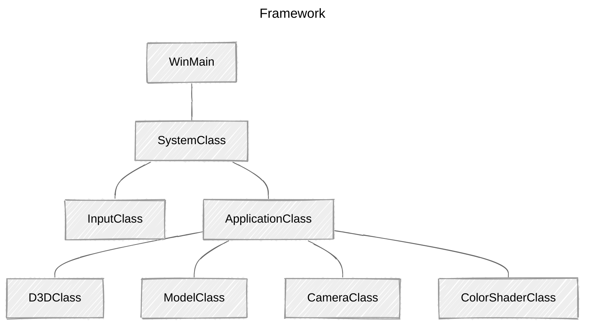

> **📖 참고자료**
>
> * [RasterTek - DirectX 11 on Windows 10 Tutorials](https://rastertek.com/tutdx11win10.html)
> * [Microsoft Learn - Direct3D 11 그래픽](https://learn.microsoft.com/ko-kr/windows/win32/api/_direct3d11/)
> 
> <br>
> 
> **🖥️ 개발환경**
> 
> *   Window 11
> *   Visual Studio 2022

<br>

## 개요

DirectX11에서 버텍스 및 픽셀 셰이더를 작성하는 방법을 소개한다. 버텍스 버퍼, 인덱스 버퍼를 사용하는 방법도 함께 다룬다. 3D 그래픽을 렌더링하기 위해 반드시 이해하고 활용해야 하는 기본적인 개념이다.

### <br>버텍스 버퍼 (Vertex Buffers)

{: .normal } {: .normal }

 

<br>

예를 들어, 3D 구 모델은 실제로 수백 개의 삼각형으로 구성되어 있다.`	`

구 모델의 각 삼각형에는 세 개의 점이 있고, 각 점을 정점(vertex)이라고 한다. 구면 모델을 렌더링하려면, 구를 구성하는 모든 정점을 버텍스 버퍼라고 하는 특수한 데이터 배열에 저장해야 한다. 구 모델의 모든 점이 버텍스 버퍼에 저장되면, GPU로 전송해 모델을 렌더링할 수 있다.

### <br>인덱스 버퍼 (Index Buffers)

인덱스 버퍼는 정점 버퍼와 관련이 있다. 인덱스 버퍼는 버텍스 버퍼에 있는 각 정점을 기록하는 것을 목표로 한다. GPU는 인덱스 버퍼를 사용해 버텍스 버퍼에서 특정 정점을 빠르게 찾을 수 있게 된다.

인덱스 버퍼의 개념은 책에서 인덱스를 사용하는 것과 유사하다. 빠른 속도로 특정 내용을 찾는데 도움을 주는 역할!

DirectX 문서에 따르면, 인덱스 버퍼를 사용하면 비디오 메모리의 더 빠른 위치에 버텍스 버퍼를 캐싱할 가능성 역시 증가한다. 인덱스 버퍼를 사용하는 것이 성능 면에서도 더 바람직하다.

### <br>버텍스 셰이더 (Vertex Shaders)

버텍스 셰이더는 주로 버텍스 버퍼의 정점을 3D 공간으로 변환하기 위해 작성된 작은 프로그램이다. 각 정점의 법선 벡터를 계산하는 등 계산 작업도 수행할 수 있다. 

정점 셰이더는 버텍스 버퍼에서 처리해야 하는 각 정점마다 GPU에 의해 호출된다. 

e.g.) 5,000개의 폴리곤 모델을 렌더링할 경우, GPU는 프레임 당 15,000번 버텍스 셰이더를 실행한다. 만약, 프로그램을 60fps로 고정시키면, 5,000개의 삼각형을 그리기 위해 초당 900,000 번 정점 셰이더를 실행한다.

따라서, 버텍스 셰이더를 효율적으로 작성하는 것이 중요하다.

<br>

### 픽셀 셰이더 (Pixel Shaders)

픽셀 셰이더는 폴리곤을 채색하기 위해 작성된 작은 프로그램이다. GPU가 화면에 그려질 각 픽셀마다 픽셀 셰이더를 실행한다. 채색, 텍스처링, 조명 효과 등 대부분의 효과는 픽셀 셰이더에서 처리한다. 

픽셀 셰이더 역시 GPU에서 호출되는 횟수가 많아지므로, 효율적으로 작성해야 한다.

<br>

### HLSL (High-Level Shader Language)

HLSL은 DX11에서 버텍스/픽셀 셰이더 프로그램을 코딩하는데 사용하는 언어이다. 문법은 C와 거의 동일하지만, 일부 사전 정의된 타입*(pre-defined types)*이 있다.

HLSL 프로그램 파일은 전역 변수, 타입 정의, 버텍스 셰이더, 픽셀 셰이더, 지오메트리 셰이더로 구성되어 있다.

이번 튜토리얼에선 DirectX 11을 사용해 아주 간단한 HLSL 프로그램을 작성한다.

<br>

---

## Updated Framework




ApplicationClass에 세 개의 클래스를 추가한다.

*   CameraClass

    *   뷰 행렬 관리
    *   월드에서의 카메라 위치 처리
    *   셰이더가 렌더링할 때, 카메라의 위치와 방향 정보*(사용자가 씬을 어디에서 보고 있는지)*를 전달

*   ModelClass

    *   3D 모델의 지오메트리 처리

        *(이 튜토리얼에서는 단순성을 위해 단일 삼각형을 다룬다.)*

*   ColorShaderClass
    *   HLSL 셰이더를 호출해 모델을 화면에 렌더링

<br>

---

## Color.vs

**셰이더 (Shader)**

*   모델을 렌더링하는 작은 프로그램 
*   HLSL으로 작성
    *   `.vs`*(버텍스 셰이더)*, `ps`*(픽셀 셰이더)* 소스 파일에 저장
    *   VS에서 새 필터/폴더를 만들어 관리
    *   Preperties 설정 *(설정하지 않을 경우 컴파일 오류 발생)*
        *   Excluded From Build:`Yes`
        *   Contents: `(공란)`
        *   Item Type: `Does not participate in build`

<br>

### Globals

```c++
/* Filename: color.vs */

/////////////
/* GLOBALS */
/////////////

cbuffer MatrixBuffer
{
	matrix worldMatrix;
	matrix viewMatrix;
	matrix projectionMatrix;
};
```

셰이더 프로그램은 전역 변수로 시작한다.

*   C++ 코드에서 값 변경 가능
    *   셰이더 프로그램에서  `int`, `float` 등 다양한 변수 사용 가능
*   일반적으로 HLSL은 전역 변수를 `cbuffer` 버퍼 객체에 저장 *(Constant Buffer)*
    *   단일 전역 변수도 해당 버퍼에 저장
    *   왜? 셰이더를 효율적으로 실행, GPU가 버퍼를 저장하는 방식을 최적화함

본 예제는 세 개의 행렬을 프레임마다 동시에 업데이트할 것이므로, 모두 동일한 버퍼에 작성한다.

<br>

### Typedefs

```c++
//////////////
/* TYPEDEFS */
//////////////

struct VertexInputType
{
	float position : POSITION;
	float4 color : COLOR;
};

struct PixelInputType
{
	float4 position : SV_POSITION;
	float4 color : COLOR;
};
```

**사용자 정의 타입 (Type Definitions)** 

*   C와 유사하게 Typedef 생성 가능!
    *   HLSL에서 사용할 수 있는 `float4` 등의 다양한 데이터 타입 사용
        *   셰이더 프로그래밍을 더 쉽게 읽고 쓸 수 있도록 함

*예제 코드 설명*

*   데이터 타입

    *   `x`, `y`, `z`, `w`: 위치 벡터*(좌표값)*

    *   `red`, `green`, `blue`, `alpha`: 색상값

*   시맨틱(*Semantic*)
    *   `POSITION`: 버텍스 셰이더에서 쓰임
    *   `SV_POSITION`: 픽셀 셰이더에서 쓰임
    *   `COLOR`: 버텍스 셰이더와 픽셀 셰이더 모두 쓰임

*=> 버텍스 셰이더와 픽셀 셰이더에서 쓰이는 시맨틱이 다르므로, 구조체를 따로 만들어야 한다!*

같은 유형을 두 개 이상 원할 경우, `COLOR0`, `COLOR1` 등 숫자를 추가한다.

<br>

### Vertex Shader

```c++
///////////////////
/* Vertex Shader */
///////////////////

PixelInputType ColorVertexShader(VertexInputType input)
{
	PixelInputType output;

	// 올바른 행렬 계산을 위해 위치 벡터를 4차원으로 확장
	input.position.w = 1.0f;

	// 월드, 뷰, 프로젝션 행렬을 통해 정점의 위치 변환(정점 위치 계산)
	output.position = mul(input.position, worldMatrix);
	output.position = mul(input.position, viewMatrix);
	output.position = mul(input.position, projectionMatrix);

	// 픽셀 셰이더가 사용할 input color 저장
	output.color = input.color;

	return output;
}
```

**Vertex Shader**: GPU가 버텍스 버퍼를 받아, 해당 데이터를 처리할 때 호출됨

*   `ColorVertexShader`는 버텍스 버퍼의 모든 정점에 대해 한 번씩 호출됨
*   버텍스 셰이더의 입력값
    *   버텍스 버퍼의 데이터 타입, 셰이더 소스 파일에서 정의한 구조체 타입과 일치해야 함
    *   *(예제의 경우, `VertexInputType`)*
*   버텍스 셰이더의 출력값
    *   버텍스 셰이더의 출력 데이터는 픽셀 셰이더로 전송됨
    *   *(예제의 경우, `PixelInputType`)*

<br>

위 내용을 고려하면, 버텍스 셰이더가 `PixelInputType` 유형의 출력 변수(`output`)를 생성한다는 것을 알 수 있다.

**이후 단계**

1.   입력 정점의 위치를 가져와 월드 ➡️ 뷰 ➡️ 투영 행렬에 곱함
     *   정점이 3D 공간에서, 시점에 맞춰 올바른 위치로 배치됨
     *   이후, 2D 화면에 렌더링
2.   출력 데이터가 입력 데이터의 색상값 복사
     *   픽셀 셰이더에 대한 입력으로 사용됨*(반환값)*

주의할 점: 입력 위치(`input.position`)의 W 좌표를 1.0으로 설정해야 한다.

*   입력 데이터는 XYZ 좌표만 받기 때문!
*   행렬 연산 시 `w`값이 없으면 오류가 생길 수 있으므로, 위치 벡터를 4차원으로 확장해야 함

<br>

---

## Color.ps


